

Projekt jelentés a következő témában:

BCA-CC-606

“Könyvesbolt Menedzsment Rendszer”

Benyújtva **Smt. K.B. Parekh Számítástechnikai Főiskola-Mahuva** számára

(A Maharaja Krishnakumarsinhji Bhavnagar Egyetemhez társult)

a követelmények részleges teljesítése érdekében a

### SZÁMÍTÁSTECHNIKAI ALKALMAZÁSOK ALAPDIPLOMA megszerzéséhez

Benyújtva:

**MAKWANA DHAVAL N. (BCA 6. félév, ülés szám: 21260256)**

**BARAIYA KUMAR K. (BCA 6. félév, ülés szám: 21260254)**

Vezető:

**ASHSISH PANDYA**

Adjunktus

Smt. K.B. Parekh Számítástechnikai Főiskola, Mahuva

**2019. március**

**Smt.K.B.Parekh Számítástechnikai Főiskola Mahuva-364290**

**(A Maharaja Krishnakumarsinhji Bhavnagar Egyetemhez társult)**

<b>Dátum:</b> 2019.03.15

**AKIKNEK EZ ÉRINTHETI**

Ez tanúsítja, hogy **Makwana Dhaval** és **Baraiya Kumar**, a Smt.K.B.Parekh Számítástechnikai Főiskola hallgatói sikeresen teljesítették **KÖNYVESBOLT MENEDZSMENT RENDSZER** projektjüket a 2019. decembertől 2019. márciusig tartó időszakban a BCA-CC-606 követelményeinek részleges teljesítéseként.

**Projektvezető neve és aláírása:**

**Az igazgató aláírása és pecsétje.**

**Cím:** Smt.K.B.Parekh Számítástechnikai Főiskola, Prabhat Nagar Road, Parekh College Campus közelében, Cooperative Housing Society, Mahuva, Gujarat 364290 Tel: 02844/228332 E-mail: kbpbcamahuva2000@gmail.com

**KÖSZÖNETNYILVÁNÍTÁS**

Sok erőfeszítést tettünk ebbe a projektbe. Azonban nem lett volna lehetséges a tanáraink kedves támogatása és segítsége nélkül. Őszinte köszönetet szeretnénk mondani mindannyiuknak.

Különösen hálásak vagyunk a K. B. Parekh Számítástechnikai Főiskolának, Mahuvának az iránymutatásukért, folyamatos felügyeletükért, valamint a projekttel kapcsolatos szükséges információk biztosításáért és támogatásukért.

Szeretnénk kifejezni hálánkat szüleinknek és a KBP tagjainak kedvességükért és ösztönzésükért, amely segített a projekt befejezésében. Végül, de nem utolsósorban, sok köszönet illeti a projektvezetőt, Ashsish Pandya urat, aki teljes erőfeszítéssel vezette a csapatot a cél elérésében. Nagyra értékeljük a többi felügyelő és a bizottságok iránymutatását, különösen a projektprezentációnkban, amelynek köszönhetően javultak az előadói készségeink.

Külön köszönetet mondunk minden fent említett személynek, hogy időt és figyelmet szenteltek nekünk. Köszönetet és elismerést mondunk kollégáinknak a projekt fejlesztésében nyújtott segítségükért és azoknak, akik önként segítettek minket képességeikkel.

**ÖSSZEFOGLALÓ**

A Könyvesbolt Menedzsment Rendszer alapvetően egy webalkalmazás, amely segíti az embereket abban, hogy megtalálják és megvásárolják a legújabb dizájnú könyveket különböző kategóriákban, mint például életrajzok, programozás, menedzsment stb. Ez azért hasznos, mert könnyebbé teszi a személyes könyvesbolt vásárlását.

Manapság a legtöbb könyvesbolt weboldalt használ. Az adminisztrátoroknak sok papírmunkájuk van, és olyan asztali, táblázatos alkalmazásokat használnak, mint az MS Excel, hogy kezeljék a felhasználók adatait digitális formában. Az előterjesztett Könyvesbolt Rendszer szerveren fut, és a felhasználók az összes regisztrációs tevékenységet kezelhetik.

Ez az alkalmazás központosított adatbázist tart fenn, így bármilyen módosítás azonnal megjelenik. Ez egy online eszköz, így egyszerre több felhasználó is bejelentkezhet és használhatja az eszközt.

Az alkalmazás célja a tranzakciók és a történeti adatok kezeléséhez szükséges kézi erőfeszítések csökkentése különböző raktárakban. Továbbá ez az alkalmazás felhasználói felületet biztosít a felhasználóknak, hogy megtekinthessék a részleteket és a könyvesbolt dizájnját.

### Tartalomjegyzék

- 1 [BEVEZETÉS](#introduction)

    - [1.1 A projekt háttere](#project_background)

    - [1.2 A projekt céljai](#objectives_of_project)

    - [1.3 A projekt célja](#purpose_of_project)

    - [1.4 A projekt terjedelme](#scope_of_project)

    - [1.5 A projekt alkalmazhatósága](#applicability_of_project)

- 2 [KÖVETELMÉNYEK ÉS ELEMZÉS](#requirement_and_analysis)

    - [2.1 Probléma meghatározása](#problem_statement)

    - [2.2 Követelmény specifikációk](#requirement_specifications)

    - [2.3 Hardver követelmények](#hardware_reqiurement)

    - [2.4 Szoftver követelmények](#Software_requirement)

    - [2.5 Tervezés és ütemezés](#planning_and_scheduling)

- 3 [RENDSZER TERVEZÉS](#system_design)

    - [3.1 Általános rendszertervezés tervezési eszközökkel](#over_all_system_design)

    - [3.2 Adatszótár](#data_dictionary)

    - [3.3 Bemenet/Kimenet tervezés](#input_output_design)

- 4 [TESZTELÉS ÉS MEGVALÓSÍTÁS](#testing_and_impementation)

    - [4.1 Alkalmazott tesztelési módszer](#testing_approach_used)

    - [4.2 Tesztesetek](#test_cases)

    - [4.3 Megvalósítási módszerek](#implementation_approaches)

- 5 [KÖVETKEZTETÉS](#conclusion)

    - [5.1 A rendszer korlátai](#limitation_of_system)

    - [5.2 A rendszer jövőbeli lehetőségei](#future_scope_of_system)

    - [5.3 Irodalomjegyzék](#bibliography)

### Ábrák tartalma

| **Ábra szám** | **Ábra neve** | **Oldalszám** |
| --- | --- | --- |
| 1   | Tervezés és ütemezés | 14  |
| 2   | Spirál modell | 20  |
| 3   | Adatfolyam diagram szimbólumok | 25  |
| 4   | 0 szintű adatfolyam diagram | 25  |
| 5   | 1es szintű adatfolyam diagram | 26  |
| 6   | BMS folyamatábra | 26  |
| 7   | Felhasználói folyamatábra | 27  |
| 8   | Use Case diagram szimbólumok | 28  |
| 9   | Felhasználói Use Case diagram | 29  |
| 10  | BMS Use Case diagram | 30  |
| 11  | Tevékenységi diagram szimbólumok | 32  |
| 12  | Felhasználói tevékenységi diagram | 33  |
| 13  | Bejelentkezési rendszer tevékenységi diagramja | 34  |
| 14  | E-R diagram szimbólumok | 35  |
| 15  | E-R diagram a Könyvesbolt Menedzsment Rendszerhez | 36  |
| 16  | BMS kezdőlap | 41  |
| 17  | BMS kiválasztott kategória | 42  |
| 18  | BMS könyvrészletek | 43  |
| 19  | BMS bejelentkezési oldal | 44  |
| 20  | BMS regisztrációs oldal | 45  |
| 21  | BMS "Kapcsolat" oldal | 46  |
| 22  | BMS kosár oldal nézőknek | 46  |
| 23  | BMS rendelési oldal | 47  |
| 24  | Bejelentkezett kezdőlap | 48  |
| 25  | BMS felhasználói könyvrészletek | 49  |
| 26  | BMS felhasználói kosár oldal | 50  |
| 27  | BMS könyv keresés | 51  |
| 28  | BMS admin bejelentkezési oldal | 51  |
| 29  | BMS admin kezdőlap | 52  |
| 30  | BMS új kategória hozzáadása | 52  |
| 31  | BMS kategória megtekintése | 53  |
| 32  | BMS új könyvek hozzáadása | 53  |
| 33  | BMS könyvek megtekintése | 54  |
| 34  | BMS kapcsolatfelvételi lista | 54  |
| 35  | BMS felhasználói lista | 55  |
| 36  | BMS jelszó visszaállítási oldal | 55  |
| 37  | Fekete doboz tesztelés | 57  |
| 38  | Szürke doboz tesztelés | 59  |
| 39  | Teszteset 1 | 60  |
| 40  | Teszteset 2 | 61  |
| 41  | Teszteset 3 | 61  |
| 42  | Teszteset 4 | 62  |

# **1. fejezet**

## [**Bevezetés**](#introduction)

### [1.1 A projekt háttere](#project_background)

- Ez a szoftver lehetővé teszi az admin számára, hogy könyv- és vásárlói adatokat tároljon.
- Könnyebb hozzáférés olyan információkhoz, mint a vásárlói adatok és a könyvek elérhetősége.
- Adattárolási lehetőséget nyújt, csökkentve a papírmunkát.
- A könyvesbolt-kezelő rendszerben a felhasználók vásárolhatnak könyveket, az admin pedig megjelenítheti a vásárlók adatait.
- Új elképzelés a könyvesbolt-kezelő rendszer működéséről.

A rendszer számítógépesítésére.

### [1.2 A projekt céljai](#objectives_of_project)

- A papírmunka csökkentése és a rendszer számítógépesítése.
- Az operatív sebesség növelése. Gyorsabb keresés és pontosság.
- Nagy adattárolás adatbázis használatával.
- A járművásárlások és -eladások manuális feldolgozása nehézkes, e projekt ezt megkönnyíti.
- Gyorsabb információ-visszakeresés.

### [1.3 A projekt célja](#purpose_of_project)

- A könyvesbolt-kezelő rendszer fő célja a papírmunkával kapcsolatos problémák megoldása.
- Egy helyen kezeli az összes tevékenységet, és az admin egyszerre több műveletet is végrehajthat.
- A rendszer képes biztonságosan tárolni a könyvekkel kapcsolatos adatokat.
- Weboldalunk a felhasználói igényekre koncentrál, és az új funkciók egyszerűvé és megbízhatóvá teszik a rendszert.

### [1.4 A projekt hatóköre](#scope_of_project)

- A rendszer célja a túlóra csökkentése és a pontos adatok kezelésének növelése.
- Pontos keresés, amely a keresési műveletekkel eredményeket ad.
- A vásárlók néhány kattintással könyveket foglalhatnak.
- Az admin hatékonyan használhatja az adatbázist, és rugalmasságot biztosít számára.

### [1.5 A projekt alkalmazhatósága](#applicability_of_project)

- Azoknak az ügyfeleknek, akik bármikor és bárhol szeretnének könyvet vásárolni.
- Az admin könyveket adhat hozzá és kezelheti a könyvek listáját.
- Az adatbázis tárolja és visszakeresi az adatokat, így mind az admin, mind a felhasználók hozzáférhetnek az adatokhoz.

# 2. fejezet

## [Követelmények és elemzés](#requirement_and_analysis)

### [2.1 Problémafelvetés](#problem_statement)

- Túl sok papírmunka.
- Az eljárás időigényes.
- Extra költségek a papírmunkával kapcsolatban.
- Nagy adattárolási igény.
- A manuális járművásárlási és eladási folyamat nehézkes.
- Gyorsabb adatvisszakeresés.
- Pontosság és következetesség hiánya a manuális rendszerben.
- Személyes késedelmek.
- Nehéz egy adott rekordot megtalálni a manuális rendszerben.
- Az alkalmazottak időpazarlása.

### [2.2 Követelményspecifikáció](#requirement_specification)

A rendszer két modult tartalmaz:

1) Admin

2) Ügyfél

#### Az admin funkciói

- Ez a modul a következő feladatokat tartalmazza:
  - Kategória hozzáadása.
  - Kategórialista megtekintése.
  - Új könyv hozzáadása.
  - Könyvek megtekintése.
  - Ügyfél üzeneteinek megtekintése.

#### Az ügyfél funkciói

- Ez a modul a következő feladatokat tartalmazza:
  - Könyvek megtekintése.
  - Könyvek kosárhoz adása.
  - Könyvkeresés.
  - Kosár megtekintése vagy tételek hozzáadása.

### [2.3 Hardverkövetelmények](#hardware_requirement)

- 32 bites operációs rendszer.
- Windows 7/8/8.1/10
- Linux Ubuntu / Light Ubuntu
- Mac OS
- 350 MB RAM

### [2.4 Szoftverkövetelmények](#software_requirement)

- Wamp Server
- MySQL
- Böngésző
- PHPMyAdmin

#### Ügyféloldali eszközök

- **Processzor:** PC kettőmagos vagy jobb processzorral (ajánlott: 2,20 GHz).
- **RAM:** 512 MB vagy több (ajánlott).
- **Merevlemez:** Legalább 45 MB szabad hely.
- **Operációs rendszer:** Windows vagy nyílt forráskódú 32/64 bites rendszer.
- Böngésző: Mozilla Firefox 2.0 / Internet Explorer 8.0 / Google Chrome.

### [2.5 Tervezés és ütemezés](#planning_and_scheduling)

Minden fejlesztési szakasz különböző időt igényel. Az alábbi táblázat mutatja az egyes fázisok becsült idejét:

| ID | Feladat neve | Kezdés/Befejezés | Időtartam |
| --- | --- | --- | --- |
| 1   | Elemzés | 2018.12.25 - 2019.01.01 | 8 nap |
| 2   | Tervezés | 2019.01.01 - 2019.01.09 | 9 nap |
| 3   | Kódolás | 2019.01.10 - 2019.02.08 | 4 hét |
| 4   | Megvalósítás | 2019.02.08 - 2019.02.12 | 5 nap |
| 5   | Tesztelés | 2019.02.12 - 2019.02.17 | 6 nap |
| 6   | Dokumentáció | 2019.02.18 - 2019.03.10 | 3 hét |

# 3. fejezet

## [Rendszertervezés](#system_design)

### [3.1 Átfogó rendszertervezés tervező eszközök használatával](#over_all_system_design)

A tervezési fázis célja egy megoldás megtervezése a követelményekben meghatározott problémára. A rendszertervezés célja a rendszer moduljainak azonosítása, ezen modulok specifikációja, valamint azok egymással való interakciója, hogy a rendszer működjön. A tervezési folyamat célja egy modell létrehozása, amely később a rendszer felépítéséhez használható. Ezt a modellt a rendszer tervének nevezzük.

A rendszertervezés folyamata az architektúra, komponensek, modulok, interfészek és adatok meghatározása a meghatározott követelmények kielégítése érdekében.

A tervezés általában két szakaszban zajlik:

- Fizikai tervezés
- Adatbázis tervezés

  

### Fizikai tervezés

A fizikai tervezés grafikus ábrázolása a rendszer belső és külső entitásainak, valamint az ezekbe és ezekből érkező adatok áramlásának. Egy belső entitás olyan entitás, amely a rendszerben található és átalakítja az adatokat.

A rendszer fizikai tervezésének ábrázolására olyan diagramokat használunk, mint az adatfolyam-diagramok, E-R diagramok, esetdiagramok stb.

### 1. Adatfolyam-diagram

Az adatfolyam-diagramok (DFD) egy információs rendszer adatáramlásának grafikus ábrázolása. Ezeket az adatfolyam-diagramokat rendszerelemzés során használják információfeldolgozó rendszerek tervezésére, de egy teljes szervezet modellezésére is alkalmasak. Az adatfolyam-diagramok fő előnye, hogy áttekintést adnak arról, hogy a rendszer milyen adatokat dolgoz fel, milyen átalakításokat végez, milyen adatokat tárol, és ezek az adatok hova áramlanak.

### Az adatfolyam-diagramokban használt szabványos szimbólumok

  

| **Szimbólum** | **Név** | **Funkció** |
| --- | --- | --- |
|     | **Adatáramlás** | A folyamatok összekapcsolására használják. A nyílfej jelzi az adatáramlás irányát. |
|     | **Folyamat** | A bemeneti adatokat kimeneti adatokra alakítja át. |
|     | **Bemenet / Kimenet** | Az adatok bevitelére vagy kivitelére szolgál. |

  

#### (3. ábra: Adatfolyam-diagram szimbólumok)

### 0. szintű DFD (Weboldal áramlás diagram)

  

  

#### (4. ábra: 0. szintű adatfolyam-diagram)

### 1. szintű DFD (Weboldal áramlás diagram)
  

#### (5. ábra: 1st szintű adatfolyam-diagram)
  

### Folyamatábra

  

#### (6. ábra: BMS folyamatábra)

### Felhasználói áramlás diagram

#### (7. ábra: Felhasználói áramlás diagram)

  

### 2. Esetdiagram

Az esetdiagram egy olyan forgatókönyvek halmaza, amelyek leírják a felhasználó és a rendszer közötti interakciókat. Az esetdiagramok megjelenítik a színészek és az esetek közötti kapcsolatot. Az esetdiagram két fő eleme az esetek és a színészek.

  

#### (8. ábra: Esetdiagram szimbólumok)

Egy színész egy felhasználót vagy egy másik rendszert képvisel, amely interakcióba lép a modellezett elemmel. Az eset a rendszer külső nézete, amely egy olyan műveletet képvisel, amelyet a felhasználó végrehajthat egy feladat teljesítéséhez.

### Felhasználói esetdiagram

#### (9. ábra: Felhasználói esetdiagram)

### BMS esetdiagram

#### (10. ábra: BMS esetdiagram)

### 3. Tevékenységdiagram

A tevékenységdiagram alapvetően egy folyamatábra, amely a tevékenységek közötti áramlást ábrázolja. A tevékenység a rendszer egy művelete.

  

| Szimbólum neve | Szimbólum | Leírás |
| --- | --- | --- |
| Kezdő szimbólum |  | A folyamat vagy a munkafolyamat kezdetét jelzi egy tevékenységdiagramon. Használható önmagában vagy egy jegyzet szimbólummal, amely magyarázza a kiindulópontot. |
| Tevékenység szimbólum |  | A modellezett folyamat tevékenységeit jelöli. Ezek a szimbólumok, amelyek rövid leírásokat tartalmaznak a formán belül, a tevékenységdiagram fő építőkövei. |
| Csatlakozó szimbólum |     | A tevékenység irányított áramlását mutatja. A befelé mutató nyíl egy lépést kezd egy tevékenységen belül; a lépés befejezése után az áramlás folytatódik a kifelé mutató nyíllal. |
| Döntési szimbólum |  | Döntést jelképez, és mindig legalább két ága van feltétel szöveggel, amely lehetővé teszi a felhasználók számára, hogy megtekintsék a lehetőségeket. Ez a szimbólum a különböző folyamatok elágazását vagy összeolvadását jelöli, ahol a szimbólum keretként vagy tartóként működik. |
| Záró szimbólum |  | A tevékenység záró állapotát jelöli, és a folyamat minden ágának befejezését képviseli. |
| Egyesítő szimbólum/Szinkronizációs vonal |  | Két párhuzamos tevékenységet egyesít, és visszavezeti őket egy olyan folyamatba, ahol csak egy tevékenység zajlik egyszerre. Vastag függőleges vagy vízszintes vonallal ábrázolva. |
| Elágazás szimbólum |  | Egy tevékenység áramlását osztja fel két párhuzamos tevékenységre. Több nyílvonal jelzi az elágazást. |

  

#### (11. ábra: Tevékenységdiagram szimbólumok)

### Felhasználói tevékenységdiagram

#### (12. ábra: Felhasználói tevékenységdiagram)

### Bejelentkezési rendszer tevékenységdiagramja

#### (13. ábra: Bejelentkezési rendszer tevékenységdiagramja)

### E-R diagram

Az entitás-kapcsolat diagram (E-R diagram) egy grafikus ábrázolás az entitások és azok kapcsolatának bemutatására. Leírja, hogyan kapcsolódnak az adatok egymáshoz. Egy entitás egy adatdarab – egy objektum vagy egy fogalom, amelyről adatot tárolunk. Egy kapcsolat pedig azt mutatja meg, hogyan osztják meg az adatokat az entitások között.

Az E-R diagramban három fő komponens található:

  

| Szimbólum | Név | Leírás |
| --- | --- | --- |
|     | Entitás | Egy entitás lehet bármilyen tárgy, hely, személy vagy bármi más. |
|     | Attribútum | Az attribútum egy entitás tulajdonságát vagy jellemzőjét írja le. |
|     | Kapcsolat | A kapcsolat az entitások közötti viszonyt írja le. |

  

#### (14. ábra: E-R diagram szimbólumok)

### E-R diagram egy könyvkereskedés menedzsment rendszerhez

#### (15. ábra: E-R diagram egy könyvkereskedés menedzsment rendszerhez)

  

### [3.2 Adatszótár](#data_dictionary)

### Adatbázis és szerkezettervezés

A rendszerben használt különböző táblák:

1. Admin
2. Könyv
3. Kategória
4. Kapcsolat
5. Regisztráció
6. Rendelés

Az összes tábla részletei és mezői:

#### Tábla neve: Admin

**Elsődleges kulcs:** a_id

**Leírás:** Az adminisztrátori bejelentkezési adatok tárolására szolgál.

| **Mező** | **Típus** | **Leírás** |
| --- | --- | --- |
| A_id | int(4) | Az adminisztrátori azonosító tárolására |
| A_unm | Varchar(3) | Az adminisztrátor felhasználónevének tárolására |
| A_pwd | Varchar(30) | Az adminisztrátor jelszavának tárolására |

#### Tábla neve: Könyv

**Elsődleges kulcs:** b_id

**Leírás:** Könyv adatok tárolása.

| **Mező** | **Típus** | **Leírás** |
| --- | --- | --- |
| B_id | Int(10) | A könyv azonosítójának tárolására |
| B_nm | Varchar(50) | A könyv nevének tárolására |
| B_cat | Int(6) | A különböző kategóriák könyvazonosítójának kiválasztására vagy tárolására |
| B_desc | Longtext | A könyv részletes leírásának tárolására |
| B_price | Int(4) | A könyv árának tárolására |
| B_img | Varchar(50) | A könyv képének nevének tárolására |
| B_time | Int(20) | A könyv beszúrásának idejének tárolására |

#### Tábla neve: Kategória

**Elsődleges kulcs:** cat_id

**Leírás:** A kategórianevek tárolására szolgál.

| **Mező** | **Típus** | **Leírás** |
| --- | --- | --- |
| Cat_id | Int(10) | A kategóriaazonosító tárolására |
| Cat_nm | Varchar(50) | A kategórianév tárolására |

#### Tábla neve: Kapcsolat

**Elsődleges kulcs:** c_id

**Leírás:** Kapcsolatfelvételi adatok tárolása.

| **Mező** | **Típus** | **Leírás** |
| --- | --- | --- |
| C_id | Int(4) | Az ügyfél/felhasználó kapcsolatfelvételi azonosítójának tárolása |
| C_fnm | Varchar(100) | A felhasználó teljes nevének tárolása |
| C_mno | Int(10) | Az ügyfél/felhasználó mobiltelefonszámának tárolása |
| C_email | Varchar(60) | Az ügyfél/felhasználó e-mail címének tárolása |
| C_msg | Longtext | Az ügyfél/felhasználó üzenetének vagy kérdésének tárolása |
| C_time | Varchar(20) | A kapcsolatfelvételi űrlap adatainak beszúrási idejének tárolása |

#### Tábla neve: Regisztráció

**Elsődleges kulcs:** r_id

**Leírás:** Látogatók vagy felhasználók regisztrációs adatai.

| **Mező** | **Típus** | **Leírás** |
| --- | --- | --- |
| R_id | Int(8) | A felhasználó regisztrációs azonosítójának tárolása |
| R_fnm | Varchar(100) | A felhasználó teljes nevének tárolása |
| R_unm | Varchar(50) | A felhasználó felhasználónevének tárolása |
| R_pwd | Varchar(30) | A felhasználó jelszavának tárolása |
| R_cno | Varchar(10) | A felhasználó kapcsolattartási számának tárolása |
| R_email | Varchar(60) | A felhasználó e-mail címének tárolása |
| R_time | Varchar(20) | A felhasználó regisztrációjának idejének tárolása |

#### Tábla neve: Rendelés

**Elsődleges kulcs:** o_id

**Leírás:** A rendelés adatai

| **Mező** | **Típus** | **Leírás** |
| --- | --- | --- |
| O_id | Int(11) | A rendelés azonosítójának tárolása |
| O_name | Varchar(30) | A felhasználó teljes nevének tárolása |
| O_address | Varchar(200) | A felhasználó címének tárolása |
| O_pincode | Int(20) | A város irányítószámának tárolása |
| O_city | Varchar(30) | A város nevének tárolása |
| O_state | Varchar(30) | Az állam tárolása |
| O_mobile | Bigint(20) | A felhasználó mobiltelefonszámának tárolása |
| O_rid | Int(8) | A regisztrációs azonosító tárolása |

### [3.3 Input/Output Design](#input_output_design)

###### 1. **Home Page**

Home Page of BMS without logged in User.

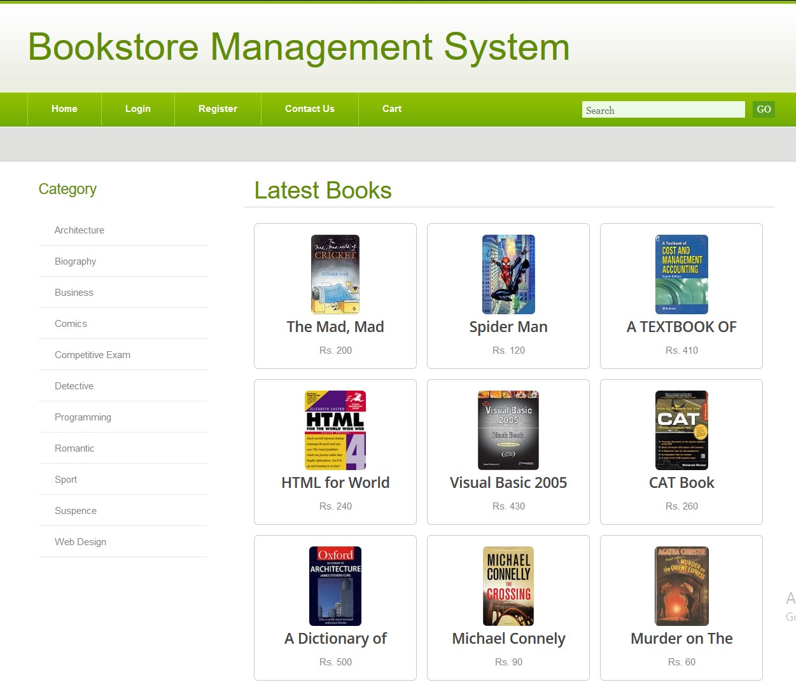

  

#### (Figure 16 : BMS Home Page)

  

###### 2. **Selected Category**

Detective Category is selected.

Shows the Books of Detective Category.

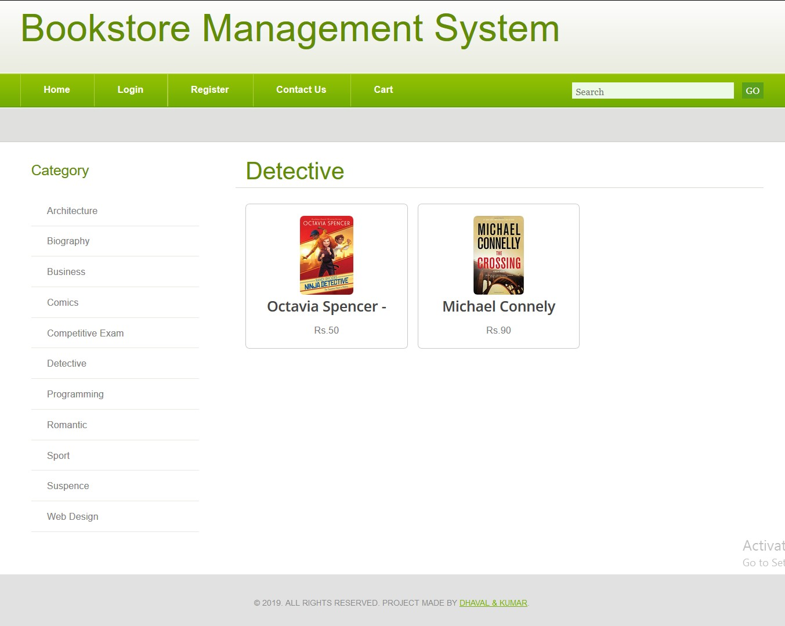

Books of Detective Category
  

  

#### (Figure 17 : BMS Selected Category)

  

###### 3. **Book Details (Before Login)**

Book Detail for Visitors.

Visitors Can’t add Books to Add to Cart.

  

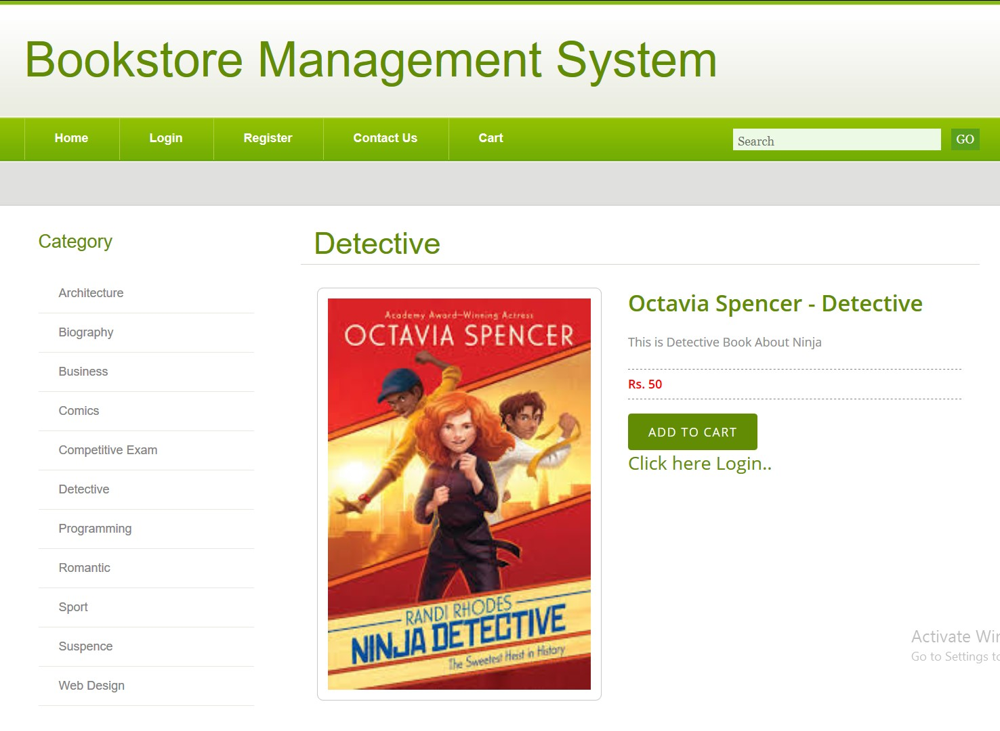

#### (Figure 18 : BMS Book Details)

  

###### 4. **Visitor Login Page**

Login Page for Viewers.

  

 

#### (Figure 19 : BMS Login Page)

  

###### 5. **Register Page**

Register Page for Viewers.

  

 

#### (Figure 20 : BMS Register Page)

  

###### 6. **Contact Us Page**

  

 

#### (Figure 21 : BMS Contact Us Page)

  

###### 7. **Cart Page**

  

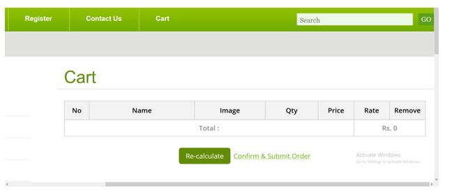
 

#### (Figure 22 : BMS Cart Page Viewers)

  

###### 8. **Order Page**

Only Cash On Delivery is Available for Orders.

  

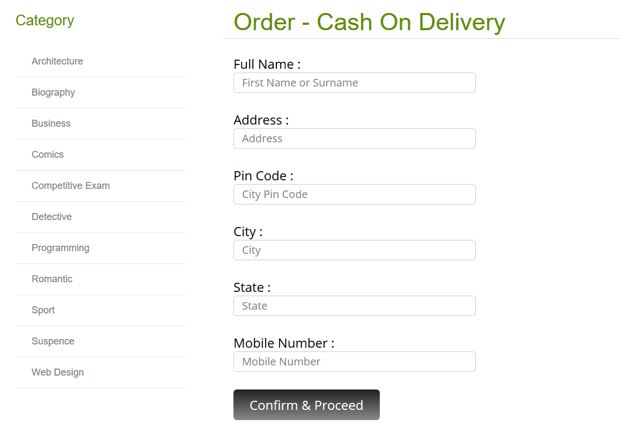 

#### (Figure 23 : BMS Order Page)

  

###### 9. **Home Page (Logged In)**

Automatically Navigation Bar Changed.

User Can Log Out.

  

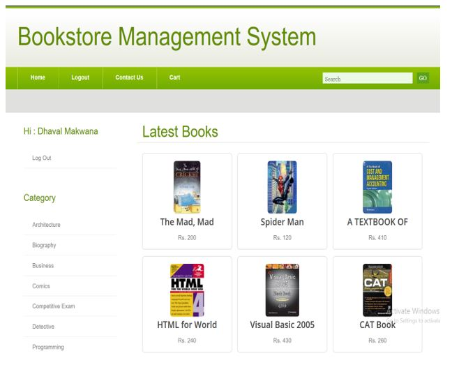  

#### (Figure 24 : BMS Logged in Page)

  

###### 10. **Book Details (Logged In)**

Users can Add Book To Add to cart.

Removed Sign in Link.

  

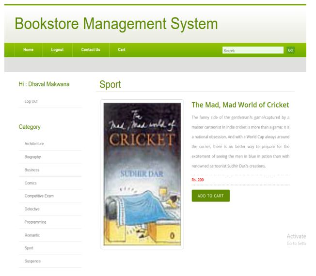 

#### (Figure 25 : BMS Users Book Details)

  

###### 11. **Add to Cart (Logged In)**

Users Can add books to add to cart.

Details of books and price.

Click Recalculate to Qty, Rate and Total will Calculate.

Users can order Books.

  

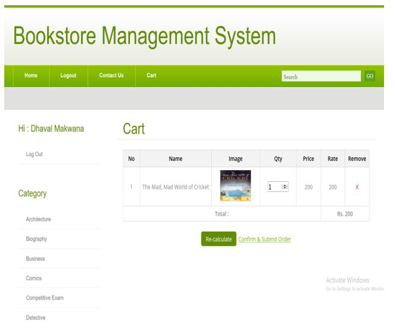
  
#### (Figure 26 : BMS Users Cart Page)

  

###### 12. **Search Books**

Book Search Feature.

  

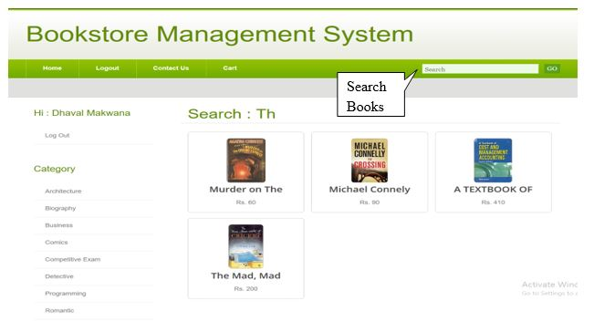
 

#### (Figure 27 : BMS Search Books)

  

###### 13. **Admin Login Page (New Template)**

  

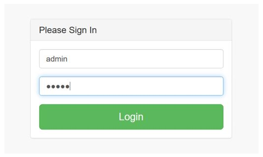

#### (Figure 28 : BMS Admin Login page)

  

###### 14. **Admin Home Page**

New Template.

  

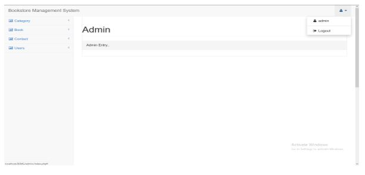

#### (Figure 29 : BMS Admin Home Page)

  

###### 15. **Add Category (Admin)**

  

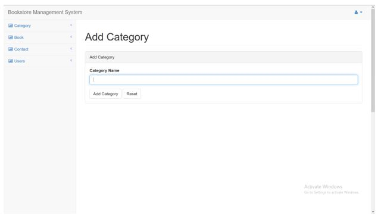

#### (Figure 30 : BMS Add New Category)

  

###### 16. **View Category**

List of Books.

  

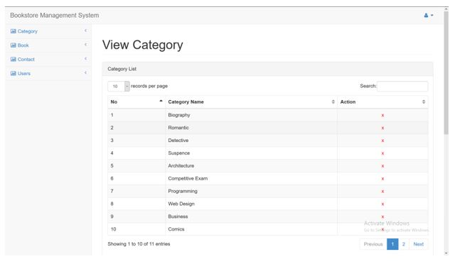

#### (Figure 31 : BMS View Category)

  

###### 17. **Add Books**

  

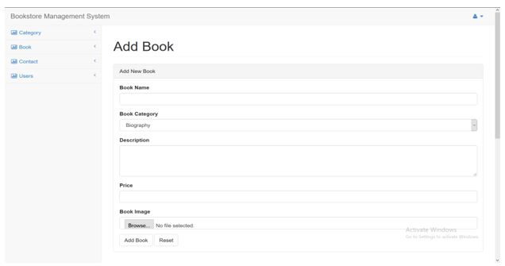

#### (Figure 32 : BMS Add New Books)

  

###### 18. **View Books**

List Books for Admin.

  

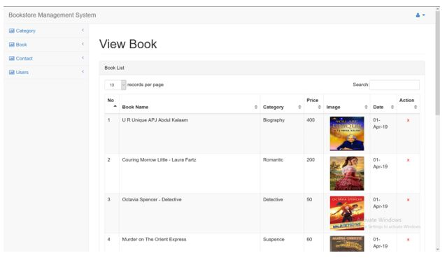

#### (Figure 33 : BMS View Books)

  

###### 19. **View Contacted List**

List of People who Contacted using Contacted Page.

  

#### (Figure 34 : BMS Contacted List Books)

###### 20. **Users List**

  

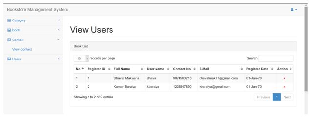

#### (Figure 35 : BMS Users List)

###### 21. **Forget Password**

  

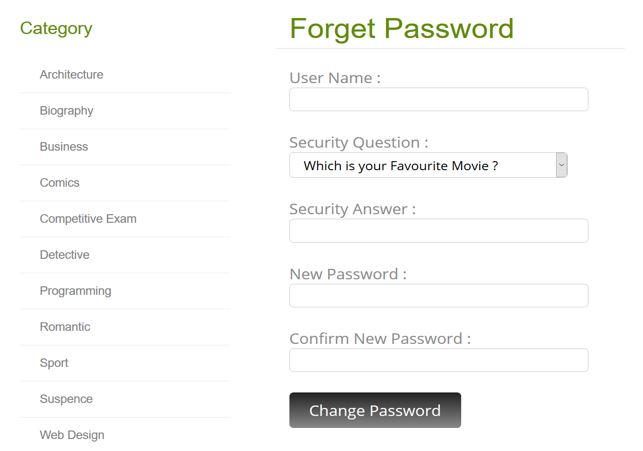

#### (Figure 36 : BMS Forget Password Page)

# Chapter 4

## [Testing And Implementation](#testing_and_impementation)

### [4.1 Testing Approach Used](#testing_approach_used)

#### -  **Black box testing**

Black-box testing is a method of software testing that examines the functionality of an application based on the specifications. It is also known as specifications based .

Testing Independent testing team usually perform this type of testing during the software testing life cycle.

This method of test can be applied to each and every level of software testing such as unit, integration, system and acceptance testing.

  

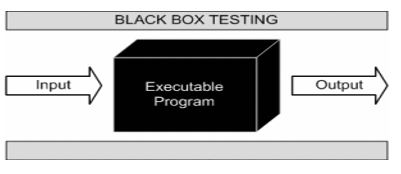

#### (Figure 37 : Black Box Testing)

  

This method is named so because the software program, in the eyes of the tester, is like a black box; inside which one cannot see. This method attempts to find errors in the following categories:

- Incorrect or missing functions
    -  Interface errors
    -  Errors in data structures or external database access
    - Behavior or performance errors
    - Initialization and termination errors

-  **Advantages of Black box Testing**

Tests are done from a user’s point of view and will help in exposing discrepancies in the specifications.

Tester need not know programming languages or how the software has been implemented.

#### - **White box testing**

White box testing is a testing technique That examines the program structure and derives test data from the program logic/code. The other names of glass box testing are clear box testing, open box testing, logic driven testing or path driven testing or structural testing.

White box testing involves looking at the structure of the code. When you know the internal structure of a product, tests can be conducted to ensure that the internal operations performed according to the specification. And all internal components have been adequately exercised.

- **White box testing techniques:**

    - A - Statement Coverage – This technique is aimed at exercising all programming statements with minimal tests.
    - B - Branch Coverage – This technique is running a series of tests to ensure that all branches are tested at least once.
    - C - Path coverage – This technique corresponds to testing all possible paths which means that each statement and branches is covered.

- **Advantages of white box Testing:**

    - 1 - Forces test developer to reason carefully about implementation.
    - 2 - Reveals errors in “hidden” code.
    - 3 - Sports the code or other issues with respect to best programming practices.

#### - **Gray-box Testing:**

Grey-box testing is a testing technique performed with limited information about the internal functionality of the system. Grey-box testers have access to the detailed design information about requirements.

Grey box are generated based on the state based modes, UML diagrams or of the target system.

Grey Box Testing is a technique to test the software product or application with partial knowledge of the internal workings of an application.

  

#### (Figure 38 : Gray Box Testing Testing)

  

### [4.2 Test Cases](#test_cases)

**4.2.1 Admin Login Detail**

<table><tbody><tr><th>
Username
</th><th>
Admin
</th><th>
Password
</th><th>
Admin
</th></tr><tr><td colspan="4">
Expected Result :
<ul><li>If fields empty then gives a error for fill up fields</li><li>If password or username does not exist then gives error for valid detail.</li></ul></td></tr></tbody></table>

**4.2.2 Login Detail**

<table><tbody><tr><th>
Username
</th><th>
Dhaval
</th><th>
Password
</th><th>
Dhaval
</th></tr><tr><td colspan="4">
Expected Result :
<ul><li>If fields empty then gives a error for fill up fields</li><li>If password or username does not exist then gives error for valid detail.</li></ul></td></tr></tbody></table>

**4.2.3 Registration Details**

<table><tbody><tr><th>
Username
</th><th>
EMPTY
</th><th>
Password
</th><th>
EMPTY
</th></tr><tr><td>
Full Name
</td><td>
EMPTY
</td><td>
Security Answer
</td><td>
EMPTY
</td></tr><tr><td colspan="4">
Expected Result :
<ul><li>If fields empty then gives a error for fill up fields</li><li>If password or username does not exist then gives error for valid detail.</li><li>If password is &lt; 8 characters then it will gives error.</li></ul></td></tr></tbody></table>

**4.2.4 Order Details**

<table><tbody><tr><th>
Full Name
</th><th>
Address
</th><th>
Contact Number
</th><th>
EMPTY
</th></tr><tr><td colspan="4">
Expected Result :
<ul><li>If fields empty then gives a error for fill up fields</li><li>If contact number is not Numeric then gives error</li></ul></td></tr></tbody></table>

<u>  

**Screen-Shots**  
</u>
  

1. **User Login**

  

#### (Figure 39 : Test Cases 1)

  

2. **Admin Login**

  

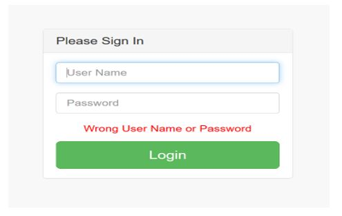

#### (Figure 40 : Text Cases 2)

  

3. **Add Book**

  

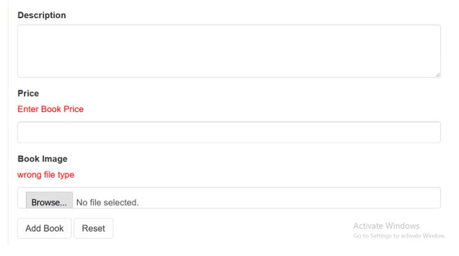

#### (Figure 41 : Text Cases 3)

  

4. **User Registration**

  

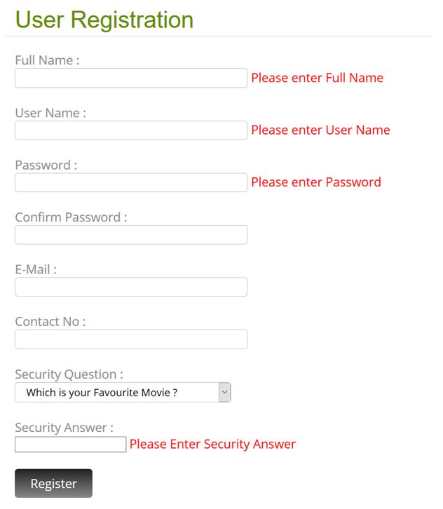

#### (Figure 42 : Text Cases 4)

  

### [4.3 Implementation approaches](#implementation_approaches)

Far the biggest challenge encountered was time constraints. Implementation takes an extraordinary amount of time and a large amount of coordination. Scheduling project meetings around every group member’s schedule has been nearly impossible. Many of the group members were unable to devote the amount of focus that the implementation stage required. Both the former and the latter problem may be more of an issue in the academic environment where priorities of the different group members are skewed in a variety of directions. Another issue that cropped up was knowledge of the PHP programming. At least two of the four group members were unfamiliar with PHP Swing API, which is php primary user interface package. Again, this may not be as much of an issue in software engineering outside the academic arena.

One of tools we found very useful, in situations where member responsibilities need to be hashed out, is the responsibility matrix. It has really been the only tool that has allowed us to continue making progress. Everyone is assigned a task, and everyone is held accountable for the completion of their assigned task. It also allows us to track tasks that need to be done. The responsibility matrix has proven to be an invaluable tool in the software engineering process.

# Chapter 5

## [Conclusion](#conclusion)

**Conclusion**

- At the first look we can say that Bookstore Management System is a perfect system but it has many limitations that are as follow :
- This is also used for list the category and books also manage the customer and books of the Bookstore.
- The Bookstore Management System is used to give information of the Books to the customer.
- We faced problems like Database creation, Flow of our system, designing of front end and back end tools, coding etc.
- Only single user can use a system at a time.
- In this system we cannot add a service module.
- We learnt new languages like jQuery, PHP, Boot-Strap, HTML, CSS, etc..

### [5.1 Limitation of system](limitation_of_system)

- Help

Currently the help feature is not available. Using this functionality user can get help about the system.

- Payment

Currently the feature of online payment is not available. User cannot give payment online.

- Multilingual

Multilingual is not supported in our system. Therefore user cannot work in different languages.

- Backup & Recovery:

User cannot take the backup or recover the data in this the system.

- Many More Others.

### [5.2 Future Scope of the System](#future_scope_of_the_system)

- Help module

Using this module user can get help on how to access the system. All functionalities of system are described in this module. And user can easily access the entire module using this feature.

- Online payment module

User can do their payment online using this functionality. In future we will add the online payment for make payment easier for the user.

- Multilingual

In this system we will add the multilingual therefore user can work in different languages and understand easily.

### [5.3 Bibliography](#bibliography)

##### Websites Used

- [www.google.com](http://www.google.com)
- [www.w3cschools.com](http://www.w3cschools.com)
- [www.stackoverflow.com](http://www.stackoverflow.com)
- [www.quora.com](http://www.quora.com)
- [www.Scribd.com](http://www.Scribd.com)

##### Apps Used

- Youtube
- Solo Learn
- Udemy..