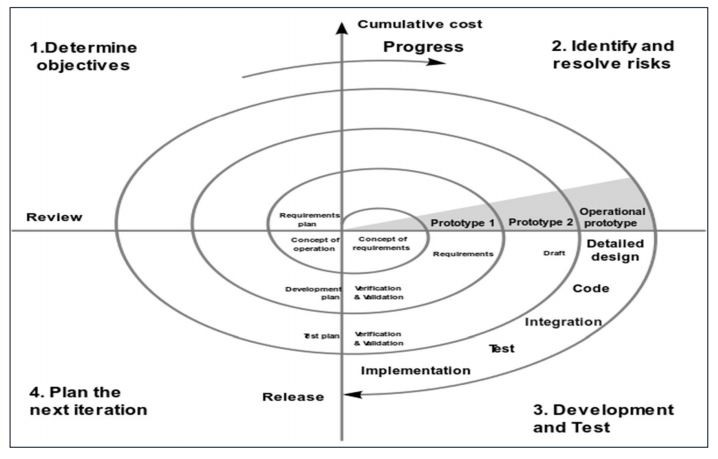
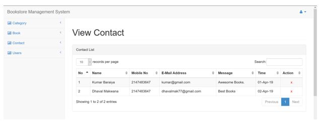

Projekt jelentés a következő témában:

BCA-CC-606

“Könyvesbolt Menedzsment Rendszer”

Benyújtva **Smt. K.B. Parekh Számítástechnikai Főiskola-Mahuva** számára

(A Maharaja Krishnakumarsinhji Bhavnagar Egyetemhez társult)

a követelmények részleges teljesítése érdekében a

### SZÁMÍTÁSTECHNIKAI ALKALMAZÁSOK ALAPDIPLOMA megszerzéséhez

Benyújtva:

**MAKWANA DHAVAL N. (BCA 6. félév, ülés szám: 21260256)**

**BARAIYA KUMAR K. (BCA 6. félév, ülés szám: 21260254)**

Vezető:

**ASHSISH PANDYA**

Adjunktus

Smt. K.B. Parekh Számítástechnikai Főiskola, Mahuva

**2019. március**

**Smt.K.B.Parekh Számítástechnikai Főiskola Mahuva-364290**

**(A Maharaja Krishnakumarsinhji Bhavnagar Egyetemhez társult)**

<b>Dátum:</b> 2019.03.15

**AKIKNEK EZ ÉRINTHETI**

Ez tanúsítja, hogy **Makwana Dhaval** és **Baraiya Kumar**, a Smt.K.B.Parekh Számítástechnikai Főiskola hallgatói sikeresen teljesítették **KÖNYVESBOLT MENEDZSMENT RENDSZER** projektjüket a 2019. decembertől 2019. márciusig tartó időszakban a BCA-CC-606 követelményeinek részleges teljesítéseként.

**Projektvezető neve és aláírása:**

**Az igazgató aláírása és pecsétje.**

**Cím:** Smt.K.B.Parekh Számítástechnikai Főiskola, Prabhat Nagar Road, Parekh College Campus közelében, Cooperative Housing Society, Mahuva, Gujarat 364290 Tel: 02844/228332 E-mail: kbpbcamahuva2000@gmail.com

**KÖSZÖNETNYILVÁNÍTÁS**

Sok erőfeszítést tettünk ebbe a projektbe. Azonban nem lett volna lehetséges a tanáraink kedves támogatása és segítsége nélkül. Őszinte köszönetet szeretnénk mondani mindannyiuknak.

Különösen hálásak vagyunk a K. B. Parekh Számítástechnikai Főiskolának, Mahuvának az iránymutatásukért, folyamatos felügyeletükért, valamint a projekttel kapcsolatos szükséges információk biztosításáért és támogatásukért.

Szeretnénk kifejezni hálánkat szüleinknek és a KBP tagjainak kedvességükért és ösztönzésükért, amely segített a projekt befejezésében. Végül, de nem utolsósorban, sok köszönet illeti a projektvezetőt, Ashsish Pandya urat, aki teljes erőfeszítéssel vezette a csapatot a cél elérésében. Nagyra értékeljük a többi felügyelő és a bizottságok iránymutatását, különösen a projektprezentációnkban, amelynek köszönhetően javultak az előadói készségeink.

Külön köszönetet mondunk minden fent említett személynek, hogy időt és figyelmet szenteltek nekünk. Köszönetet és elismerést mondunk kollégáinknak a projekt fejlesztésében nyújtott segítségükért és azoknak, akik önként segítettek minket képességeikkel.

**ÖSSZEFOGLALÓ**

A Könyvesbolt Menedzsment Rendszer alapvetően egy webalkalmazás, amely segíti az embereket abban, hogy megtalálják és megvásárolják a legújabb dizájnú könyveket különböző kategóriákban, mint például életrajzok, programozás, menedzsment stb. Ez azért hasznos, mert könnyebbé teszi a személyes könyvesbolt vásárlását.

Manapság a legtöbb könyvesbolt weboldalt használ. Az adminisztrátoroknak sok papírmunkájuk van, és olyan asztali, táblázatos alkalmazásokat használnak, mint az MS Excel, hogy kezeljék a felhasználók adatait digitális formában. Az előterjesztett Könyvesbolt Rendszer szerveren fut, és a felhasználók az összes regisztrációs tevékenységet kezelhetik.

Ez az alkalmazás központosított adatbázist tart fenn, így bármilyen módosítás azonnal megjelenik. Ez egy online eszköz, így egyszerre több felhasználó is bejelentkezhet és használhatja az eszközt.

Az alkalmazás célja a tranzakciók és a történeti adatok kezeléséhez szükséges kézi erőfeszítések csökkentése különböző raktárakban. Továbbá ez az alkalmazás felhasználói felületet biztosít a felhasználóknak, hogy megtekinthessék a részleteket és a könyvesbolt dizájnját.

### Tartalomjegyzék

- 1 [BEVEZETÉS](#introduction)

    - [1.1 A projekt háttere](#project_background)

    - [1.2 A projekt céljai](#objectives_of_project)

    - [1.3 A projekt célja](#purpose_of_project)

    - [1.4 A projekt terjedelme](#scope_of_project)

    - [1.5 A projekt alkalmazhatósága](#applicability_of_project)

- 2 [KÖVETELMÉNYEK ÉS ELEMZÉS](#requirement_and_analysis)

    - [2.1 Probléma meghatározása](#problem_statement)

    - [2.2 Követelmény specifikációk](#requirement_specifications)

    - [2.3 Hardver követelmények](#hardware_reqiurement)

    - [2.4 Szoftver követelmények](#Software_requirement)

    - [2.5 Tervezés és ütemezés](#planning_and_scheduling)

- 3 [RENDSZER TERVEZÉS](#system_design)

    - [3.1 Általános rendszertervezés tervezési eszközökkel](#over_all_system_design)

    - [3.2 Adatszótár](#data_dictionary)

    - [3.3 Bemenet/Kimenet tervezés](#input_output_design)

- 4 [TESZTELÉS ÉS MEGVALÓSÍTÁS](#testing_and_impementation)

    - [4.1 Alkalmazott tesztelési módszer](#testing_approach_used)

    - [4.2 Tesztesetek](#test_cases)

    - [4.3 Megvalósítási módszerek](#implementation_approaches)

- 5 [KÖVETKEZTETÉS](#conclusion)

    - [5.1 A rendszer korlátai](#limitation_of_system)

    - [5.2 A rendszer jövőbeli lehetőségei](#future_scope_of_system)

    - [5.3 Irodalomjegyzék](#bibliography)

### Ábrák tartalma

| **Ábra szám** | **Ábra neve** |
| --- | --- |
| 1   | [Tervezés és ütemezés](#planning_and_scheduling) |
| 2   | [Spirál modell](spiral_model) |
| 3   | [Adatfolyam diagram szimbólumok](data_flow_diagram_symbols) |
| 4   | [0 szintű adatfolyam diagram](#0_level_data_flow_diagram) |
| 5   | [1-es szintű adatfolyam diagram](#1_level_data_flow_diagram) |
| 6   | [BMS folyamatábra](#BMS_flowchart_diagram) |
| 7   | [Felhasználói folyamatábra](#user_flow_diagram) |
| 8   | [Use Case diagram szimbólumok](#use_case_diagram_symbols) |
| 9   | [Felhasználói Use Case diagram](#user_use_case_diagram) |
| 10  | [BMS Use Case diagram](#BMS_use_case_diagram) |
| 11  | [Tevékenységi diagram szimbólumok](#activity_diagram_symbols) |
| 12  | [Felhasználói tevékenységi diagram](#user_activity_diagram) |
| 13  | [Bejelentkezési rendszer tevékenységi diagramja](#login_system_activity_diagram) |
| 14  | [E-R diagram szimbólumok](#E-R_diagram_symbols) |
| 15  | [E-R diagram a Könyvesbolt Menedzsment Rendszerhez](#E-R_diagram_for_BMS) |
| 16  | [BMS kezdőlap](#BMS_home_page) |
| 17  | [BMS kiválasztott kategória](#BMS_selected_category) |
| 18  | [BMS könyvrészletek](#BMS_book_details) |
| 19  | [BMS bejelentkezési oldal](#BMS_login_page) |
| 20  | [BMS regisztrációs oldal](#BMS_register_page) |
| 21  | [BMS "Kapcsolat" oldal](#BMS_contact_us_page) |
| 22  | [BMS kosár oldal nézőknek](#BMS_cart_page_viewers) |
| 23  | [BMS rendelési oldal](#BMS_order_page) |
| 24  | [Bejelentkezett kezdőlap](#logged_in_home_page) |
| 25  | [BMS felhasználói könyvrészletek](#BMS_users_book_details) |
| 26  | [BMS felhasználói kosár oldal](#BMS_users_cart_page) |
| 27  | [BMS könyv keresés](#BMS_search_books) |
| 28  | [BMS admin bejelentkezési oldal](#BMS_admin_login_page) |
| 29  | [BMS admin kezdőlap](#BMS_admin_home_page) |
| 30  | [BMS új kategória hozzáadása](#BMS_add_new_category) |
| 31  | [BMS kategória megtekintése](#BMS_view_category) |
| 32  | [BMS új könyvek hozzáadása](#BMS_add_new_books) |
| 33  | [BMS könyvek megtekintése](#BMS_view_books) |
| 34  | [BMS kapcsolatfelvételi lista](#BMS_contacted_list_books) |
| 35  | [BMS felhasználói lista](#BMS_users_list) |
| 36  | [BMS jelszó visszaállítási oldal](#BMS_forget_password_page) |
| 37  | [Fekete doboz tesztelés](#black_box_testing) |
| 38  | [Szürke doboz tesztelés](#gray_box_testing) | 
| 39  | [Teszteset 1](#testcase_1) |
| 40  | [Teszteset 2](#testcase_2) |
| 41  | [Teszteset 3](#testcase_3) |
| 42  | [Teszteset 4](#testcase_4) |

# **1. fejezet**

## [**Bevezetés**](#introduction)

### [1.1 A projekt háttere](#project_background)

- Ez a szoftver lehetővé teszi az admin számára, hogy könyv- és vásárlói adatokat tároljon.
- Könnyebb hozzáférés olyan információkhoz, mint a vásárlói adatok és a könyvek elérhetősége.
- Adattárolási lehetőséget nyújt, csökkentve a papírmunkát.
- A könyvesbolt-kezelő rendszerben a felhasználók vásárolhatnak könyveket, az admin pedig megjelenítheti a vásárlók adatait.
- Új elképzelés a könyvesbolt-kezelő rendszer működéséről.

A rendszer számítógépesítésére.

### [1.2 A projekt céljai](#objectives_of_project)

- A papírmunka csökkentése és a rendszer számítógépesítése.
- Az operatív sebesség növelése. Gyorsabb keresés és pontosság.
- Nagy adattárolás adatbázis használatával.
- A járművásárlások és -eladások manuális feldolgozása nehézkes, e projekt ezt megkönnyíti.
- Gyorsabb információ-visszakeresés.

### [1.3 A projekt célja](#purpose_of_project)

- A könyvesbolt-kezelő rendszer fő célja a papírmunkával kapcsolatos problémák megoldása.
- Egy helyen kezeli az összes tevékenységet, és az admin egyszerre több műveletet is végrehajthat.
- A rendszer képes biztonságosan tárolni a könyvekkel kapcsolatos adatokat.
- Weboldalunk a felhasználói igényekre koncentrál, és az új funkciók egyszerűvé és megbízhatóvá teszik a rendszert.

### [1.4 A projekt hatóköre](#scope_of_project)

- A rendszer célja a túlóra csökkentése és a pontos adatok kezelésének növelése.
- Pontos keresés, amely a keresési műveletekkel eredményeket ad.
- A vásárlók néhány kattintással könyveket foglalhatnak.
- Az admin hatékonyan használhatja az adatbázist, és rugalmasságot biztosít számára.

### [1.5 A projekt alkalmazhatósága](#applicability_of_project)

- Azoknak az ügyfeleknek, akik bármikor és bárhol szeretnének könyvet vásárolni.
- Az admin könyveket adhat hozzá és kezelheti a könyvek listáját.
- Az adatbázis tárolja és visszakeresi az adatokat, így mind az admin, mind a felhasználók hozzáférhetnek az adatokhoz.

# 2. fejezet

## [Követelmények és elemzés](#requirement_and_analysis)

### [2.1 Problémafelvetés](#problem_statement)

- Túl sok papírmunka.
- Az eljárás időigényes.
- Extra költségek a papírmunkával kapcsolatban.
- Nagy adattárolási igény.
- A manuális járművásárlási és eladási folyamat nehézkes.
- Gyorsabb adatvisszakeresés.
- Pontosság és következetesség hiánya a manuális rendszerben.
- Személyes késedelmek.
- Nehéz egy adott rekordot megtalálni a manuális rendszerben.
- Az alkalmazottak időpazarlása.

### [2.2 Követelményspecifikáció](#requirement_specification)

A rendszer két modult tartalmaz:

1) Admin

2) Ügyfél

#### Az admin funkciói

- Ez a modul a következő feladatokat tartalmazza:
  - Kategória hozzáadása.
  - Kategórialista megtekintése.
  - Új könyv hozzáadása.
  - Könyvek megtekintése.
  - Ügyfél üzeneteinek megtekintése.

#### Az ügyfél funkciói

- Ez a modul a következő feladatokat tartalmazza:
  - Könyvek megtekintése.
  - Könyvek kosárhoz adása.
  - Könyvkeresés.
  - Kosár megtekintése vagy tételek hozzáadása.

### [2.3 Hardverkövetelmények](#hardware_requirement)

- 32 bites operációs rendszer.
- Windows 7/8/8.1/10
- Linux Ubuntu / Light Ubuntu
- Mac OS
- 350 MB RAM

### [2.4 Szoftverkövetelmények](#software_requirement)

- Wamp Server
- MySQL
- Böngésző
- PHPMyAdmin

#### Ügyféloldali eszközök

- **Processzor:** PC kettőmagos vagy jobb processzorral (ajánlott: 2,20 GHz).
- **RAM:** 512 MB vagy több (ajánlott).
- **Merevlemez:** Legalább 45 MB szabad hely.
- **Operációs rendszer:** Windows vagy nyílt forráskódú 32/64 bites rendszer.
- **Böngésző:** Mozilla Firefox 2.0 / Internet Explorer 8.0 / Google Chrome.

Itt van a megadott markdown kód magyarra fordítva:

### [2.5 Tervezés és ütemezés](#planning_and_scheduling)

A projektciklus minden szakaszához eltérő időtartamra lehet szükség, a projektciklus kulcsfontosságú aspektusainak sajátosságaitól függően, amelyek a fejlesztési folyamat során megjelennek. Az előfejlesztési szakasz követelményeinek összegyűjtése során beszerzett információk alapot adnak a követelmények elemzéséhez, és az információt tovább használják a tervezési fázisban.

**Tervezés és ütemezés:**

| ID | Feladat neve | Kezdés/Befejezés | Időtartam |
| --- | --- | --- | --- |
| 1   | Elemzés | 2018.12.25 - 2019.01.01 | 8 nap |
| 2   | Tervezés | 2019.01.01 - 2019.01.09 | 9 nap |
| 3   | Kódolás | 2019.01.10 - 2019.02.08 | 4 hét |
| 4   | Megvalósítás | 2019.02.08 - 2019.02.12 | 5 nap |
| 5   | Tesztelés | 2019.02.12 - 2019.02.17 | 6 nap |
| 6   | Dokumentáció | 2019.02.18 - 2019.03.10 | 3 hét |

#### [(1. ábra: Tervezés és ütemezés)](#planning_and_scheduling)

A fenti ütemterv meghatározza az eltérő szoftverfejlesztési fázisokban szükséges becsült időt, figyelembe véve minden helyzeti tényezőt. A csapattagok technikailag készen állnak, elfogadva néhány napos képzést a technológiai ismeretek megszerzésére. Így a számítások szerint megvalósítható egy ilyen megoldás időben. "**Az ütemtervet minden fázis végén felülvizsgálják és frissítik, ahogy szükséges.**"

### **Technológia rövid áttekintése**

## **Frontend - HTML, CSS, BOOTSTRAP**

1. **HTML**

Az HTML a HYPER TEXT MARKUP LANGUAGE rövidítése, amely a legszélesebb körben használt nyelv a weben, weboldalak fejlesztésére. Az HTML azokat a módokat jelöli, ahogyan a weboldalak (HTML dokumentumok) összekapcsolódnak. Így a weboldalon elérhető hivatkozásokat hipertextnek nevezzük.

Az HTML-t Berners-Lee hozta létre 1991 végén, de az "HTML 2.0" volt az első szabványos HTML specifikáció, amelyet 1995-ben publikáltak. Az HTML 4.01 az HTML egy jelentős verziója volt, amelyet 1999 végén publikáltak. Bár az HTML 4.01 verziót széles körben használják, jelenleg az HTML-5 verzió van, amely kiterjesztése az HTML 4.01-nek, és ezt a verziót 2012-ben publikálták.

Ahogy a neve is sugallja, az HTML egy jelölőnyelv, amely azt jelenti, hogy HTML-t használsz arra, hogy egyszerűen "megjelenítsd" egy szöveges dokumentumot címkékkel, amelyek megmondják a webböngészőnek, hogyan szerkezti meg azt a megjelenítéshez.

Eredetileg az HTML-t a dokumentumok struktúrájának meghatározására fejlesztették ki, mint például címek, bekezdések, listák stb., hogy megkönnyítsék a tudományos információk megosztását a kutatók között. Ma az HTML-t széles körben használják weboldalak formázására a HTML-ben elérhető különböző címkék segítségével.

2. **CSS**

A Cascading Style Sheet (CSS) egy stíluslap-nyelv, amelyet egy jelölőnyelvben írt dokumentum megjelenésének leírására használnak. Bár leggyakrabban a HTML és XHTML nyelvben írt weboldalak és felhasználói felületek vizuális stílusának beállítására használják, a nyelv bármely XML dokumentumra alkalmazható, beleértve a sima XML-t, SVG-t és XUL-t, és alkalmazható beszédbeli megjelenítésre, vagy más médiákon. A HTML és JavaScript mellett a CSS a legtöbb weboldal által használt alaptechnológia a vizuálisan vonzó weboldalak, webalkalmazások felhasználói felületeinek és sok mobilalkalmazás felhasználói felületeinek létrehozásához.

A CSS-t elsősorban arra tervezték, hogy lehetővé tegye a dokumentumtartalom elválasztását a dokumentum megjelenésétől, beleértve olyan aspektusokat, mint a felépítés, színek és betűtípusok. Ez a szétválasztás javíthatja a tartalom hozzáférhetőségét, nagyobb rugalmasságot és kontrollt biztosíthat a megjelenítési jellemzők megadásában, lehetővé teszi, hogy több HTML-oldal közös formázást oszthasson meg egy különálló .css fájlban megadott releváns CSS segítségével, és csökkenti a strukturális tartalomban a bonyolultságot és az ismétlést.

A CSS specifikációit a World Wide Web Consortium (W3C) karbantartja. Az interneti médiatípus (MIME típus) text/css a CSS használatára bejegyzett RFC 2318 (1998. március) szerint. A W3C ingyenes CSS validációs szolgáltatást üzemeltet a CSS dokumentumok számára.

A CSS-nek egyszerű szintaxisa van, és számos angol kulcsszót használ különböző stílusjellemzők neveinek megadására. A stíluslap szabályok listájából áll. Minden szabály vagy szabálykészlet egy vagy több kiválasztóból és egy deklarációs blokkból áll.

3. **BOOTSTRAP**

A Bootstrap egy ingyenes és nyílt forráskódú frontend webkeretrendszer weboldalak és webalkalmazások tervezésére. HTML- és CSS-alapú tervezési sablonokat tartalmaz tipográfiához, űrlapokhoz, gombokhoz, navigációhoz és egyéb felhasználói felületi komponensekhez, valamint opcionális JavaScript kiterjesztéseket. A legtöbb webkeretrendszertől eltérően a Bootstrap csak a frontend fejlesztéssel foglalkozik.

A Bootstrap moduláris, és egy sor less stíluslapból áll, amelyek a készlet különböző komponenseit valósítják meg. Ezeket a stíluslapokat általában egy csomagba állítják össze, és weboldalakba illesztik, de az egyes komponensek külön beilleszthetők vagy eltávolíthatók. A Bootstrap számos konfigurációs változót biztosít, amelyek irányítják a különböző komponensek színét és párnázását.

A Bootstrap 2 óta a Bootstrap dokumentáció egy testreszabási varázslót is tartalmaz, amely a kért komponensek és különböző beállítások alapján generálja a testreszabott Bootstrap verziót.

A Bootstrap 4-től kezdve a stíluslapokhoz a less helyett a SCSS-t használják. Minden Bootstrap komponens HTML struktúrából, CSS deklarációkból és egyes esetekben kísérő JavaScript kódokból áll.

## **Backend - PHP, MySQL**

1. **PHP**

A PHP Hypertext Pre-processor (PHP) egy programozási nyelv, amely lehetővé teszi a webfejlesztők számára, hogy dinamikus tartalmat hozzanak létre, amely interakcióba lép az adatbázisokkal. A PHP alapvetően webalapú szoftveralkalmazások fejlesztésére használják. Ez az útmutató segít a PHP alapjainak elsajátításában. A PHP egy kis nyílt forráskódú projektként indult, amely fokozatosan fejlődött, ahogy egyre több ember felfedezte hasznosságát. Rasmus Lerdorf 1994

-ben adta ki a PHP első verzióját.

- A PHP egy rekurzív mozaikszó, amely a "PHP: Hypertext Preprocessor"-t jelenti.
- A PHP egy szerveroldali szkriptnyelv, amely be van ágyazva a HTML-be. Dinamikus tartalom, adatbázisok kezelése, munkamenetek nyomon követése, sőt egész e-kereskedelmi webhelyek létrehozására is használják.
- Számos népszerű adatbázissal integrálva van, beleértve a MySQL, Postgre SQL, Oracle, Sybase, Informix és Microsoft SQL Server.
- A PHP végrehajtása gyors, különösen, ha Apache modulként van lefordítva Unix környezetben. A MySQL szerver, amint elindult, még a nagyon bonyolult lekérdezéseket is rekordidő alatt hajtja végre, hatalmas eredményhalmazokkal.
- A PHP támogatja a főbb protokollok széles választékát, például a POP3-at, IMAP-ot és LDAP-ot. A PHP4 hozzáadta a Java és a megosztott objektum architektúrák (COM és CORBA) támogatását, így a n-tiers fejlesztés lehetővé vált először.
- A PHP megbocsátó: a PHP nyelv arra törekszik, hogy a lehető legmegbocsátóbb legyen.
- A PHP szintaxisa C-szerű.

2. **MySQL**

A MySQL egy adatbázis, amelyet széles körben használnak adatok lekérdezésére, frissítésére és kezelésére adatbázisokban.

A MySQL egy nyílt forráskódú RDBMS, amely az SQL-t használja az adatok feldolgozására az adatbázisban. A MySQL API-kat biztosít olyan nyelvekhez, mint a C, C++, Eiffel, JAVA, Perl, PHP és Python. A MySQL a leggyakrabban webalkalmazásokhoz és beágyazott alkalmazásokhoz használják, és népszerű alternatívává vált a tulajdonosi adatbázis-rendszerekhez képest, sebessége és megbízhatósága miatt. A MySQL UNIX, Windows és Mac OS alatt is futtatható.

### **Projekt elemzése és tervezése**

A BMS kulcsfontosságú az online rendelés beállításához, hogy a vásárlók böngészhessenek a könyvkategóriák között. Ez egy kis léptékű projekt a BMS számára. Az alapötlet az, hogy a vásárlók bármikor bárhonnan vásárolhatnak könyveket készpénzért.

**Felhasználó**

- A felhasználó regisztrálhat, bejelentkezhet, kijelentkezhet a rendszerből.
- Különböző kategóriák között böngészhet és könyveket vásárolhat.
- Kapcsolatba léphet az adminisztrátorral.
- Könyveket adhat a kosárhoz.
- Könyveket rendelhet.

    **Funkcionalitás**

    - Egyszerre egy vagy több felhasználó látogatja meg a weboldalt.

    **Használhatóság**

    - Ez a weboldal bármely böngészőben futtatható.

    **Teljesítmény**

    - A weboldal a felhasználó operációs rendszerének megfelelően működik.

**Adminisztrátor**

- Az adminisztrátor kezelheti a rendszert.
- Könyveket biztosít.

**Funkcionalitás**

- Az adminisztrátor könyvet adhat hozzá vagy kezelheti a nyilvántartásokat.

## **Spirálmodell**

A spirálmodell az iteratív fejlesztés ötletét ötvözi a vízesésmodell rendszerszerű, ellenőrzött aspektusaival. Ez a spirálmodell az iteratív fejlesztési folyamatmodellt és a soros lineáris fejlesztési modellt, azaz a vízesésmodellt kombinálja, nagyon nagy hangsúlyt fektetve a kockázatelemzésre. Lehetővé teszi a termék fokozatos kiadását vagy a fokozatos finomítást a spirál körüli minden iteráción keresztül.

#### **Spirálmodell - Tervezés**

A spirálmodell négy fázisból áll. Egy szoftverprojekt többször is áthalad ezeken a fázisokon, amelyeket spirális iterációknak nevezünk.

#### **Azonosítás**

Ez a fázis a üzleti követelmények összegyűjtésével kezdődik az alapvonal spirálban. A későbbi spirálokban, ahogy a termék érik, a rendszerkövetelmények, az alrendszerek követelményei és az egység követelményei mind ebben a fázisban történnek.

Ez a fázis magában foglalja a rendszerkövetelmények megértését is, folyamatos kommunikáció révén a vevő és a rendszelemző között. A spirál végén a terméket az azonosított piacon telepítik.

#### **Tervezés**

A tervezési fázis az alapvonal spirálban a koncepcionális tervezéssel kezdődik, és magában foglalja az architektúrák tervezését, a modulok logikai tervezését, a fizikai terméktervezést és a végső tervezést a későbbi spirálokban.

#### **Építés**

Az építési fázis az aktuális szoftvertermék előállítását jelenti minden spirálban. Az alapvonal spirálban, amikor a termék csak elképzelés alatt áll, és a tervezés folyamatban van, egy POC (Proof of Concept) készül ebben a fázisban, hogy visszajelzést kapjon az ügyféltől.

Ezután a következő spirálokban, ahol a követelmények és a tervezési részletek nagyobb világossággal bírnak, egy működő modellt, az úgynevezett buildet állítanak elő egy verziószámmal. Ezeket a build-eket visszajelzés céljából az ügyfélnek küldik.

#### **Értékelés és kockázatelemzés**

A kockázatelemzés magában foglalja a technikai megvalósíthatóság és a menedzsment kockázatok azonosítását, becslését és nyomon követését, például az ütemezési csúszást és a költségvetési túllépést. A build tesztelése után, az első iteráció végén, az ügyfél értékeli a szoftvert, és visszajelzést ad.

A következő illusztráció a Spirálmodellt képviseli, felsorolva a tevékenységeket minden fázisban.

#### [(2. ábra: Spirálmodell)](#spiral_model)

Az ügyfél értékelése alapján a szoftverfejlesztési folyamat belép a következő iterációba, és ezt követően a lineáris megközelítést követi az ügyfél által javasolt visszajelzés megvalósításához. Az iterációs folyamat a spirál mentén folytatódik a szoftver életciklusa során.

**A Spirálmodell alkalmazása**

A Spirálmodell széles körben használják a szoftveriparban, mivel összhangban van bármely termék természetes fejlődési folyamatával, azaz a tanulással és a megvalósítással, amely minimális kockázatot jelent az ügyfél és a fejlesztőcégek számára is.

A következő pontok magyarázzák a Spirálmodell tipikus használatát −

- Amikor költségvetési korlátozás van, és a kockázatelemzés fontos.
- Közepes és magas kockázatú projektekhez.
- Hosszú távú projektelkötelezettség, mivel a gazdasági prioritások változásai miatt a követelmények idővel változhatnak.
- Az ügyfél nem biztos a követelményeiben, ami általában a helyzet.
- A követelmények bonyolultak és értékelést igényelnek a világosság érdekében.
- Új termékvonal, amelyet fokozatosan kell kiadni, hogy elegendő ügyfélvisszajelzést kapjon.
- Jelentős változások várhatóak a termék fej

lesztési ciklusa során.

**A Spirálmodell előnyei és hátrányai**

A spirális életciklus modell előnye az, hogy lehetővé teszi a termék elemeinek hozzáadását, amikor azok elérhetővé válnak vagy ismertek. Ez biztosítja, hogy ne legyen ellentmondás a korábbi követelményekkel és a tervezéssel.

Ez a módszer összhangban áll azokkal a megközelítésekkel, amelyek több szoftver build-et és kiadást tartalmaznak, lehetővé téve a zökkenőmentes átmenetet egy karbantartási tevékenységhez. E módszer másik pozitív aspektusa, hogy a spirálmodell korai felhasználói részvételt kényszerít a rendszerfejlesztési erőfeszítés során.

Másrészt, nagyon szigorú irányításra van szükség az ilyen termékek befejezéséhez, és fennáll a kockázat, hogy a spirált határozatlan hurokba futtatják. Tehát a változások irányításának és a változtatási kérelmek mértékének figyelembevétele nagyon fontos a termék sikeres fejlesztéséhez és telepítéséhez.

A Spirál SDLC modell előnyei a következők −

1. A változó követelmények figyelembevételére képes.
2. Lehetővé teszi a prototípusok széleskörű használatát.
3. A követelmények pontosabban rögzíthetők.
4. A felhasználók korán látják a rendszert.
5. A fejlesztés kisebb részekre osztható, és a kockázatos részek korábban fejleszthetők, ami segít a kockázatkezelésben.

   

# 3. fejezet

## [Rendszertervezés](#system_design)

### [3.1 Átfogó rendszertervezés tervező eszközök használatával](#over_all_system_design)

A tervezési fázis célja egy megoldás megtervezése a követelményekben meghatározott problémára. A rendszertervezés célja a rendszer moduljainak azonosítása, ezen modulok specifikációja, valamint azok egymással való interakciója, hogy a rendszer működjön. A tervezési folyamat célja egy modell létrehozása, amely később a rendszer felépítéséhez használható. Ezt a modellt a rendszer tervének nevezzük.

A rendszertervezés folyamata az architektúra, komponensek, modulok, interfészek és adatok meghatározása a meghatározott követelmények kielégítése érdekében.

A tervezés általában két szakaszban zajlik:

- Fizikai tervezés
- Adatbázis tervezés

  

### Fizikai tervezés

A fizikai tervezés grafikus ábrázolása a rendszer belső és külső entitásainak, valamint az ezekbe és ezekből érkező adatok áramlásának. Egy belső entitás olyan entitás, amely a rendszerben található és átalakítja az adatokat.

A rendszer fizikai tervezésének ábrázolására olyan diagramokat használunk, mint az adatfolyam-diagramok, E-R diagramok, esetdiagramok stb.

### 1. Adatfolyam-diagram

Az adatfolyam-diagramok (DFD) egy információs rendszer adatáramlásának grafikus ábrázolása. Ezeket az adatfolyam-diagramokat rendszerelemzés során használják információfeldolgozó rendszerek tervezésére, de egy teljes szervezet modellezésére is alkalmasak. Az adatfolyam-diagramok fő előnye, hogy áttekintést adnak arról, hogy a rendszer milyen adatokat dolgoz fel, milyen átalakításokat végez, milyen adatokat tárol, és ezek az adatok hova áramlanak.

### Az adatfolyam-diagramokban használt szabványos szimbólumok

  

| **Szimbólum** | **Név** | **Funkció** |
| --- | --- | --- |
|     | **Adatáramlás** | A folyamatok összekapcsolására használják. A nyílfej jelzi az adatáramlás irányát. |
|     | **Folyamat** | A bemeneti adatokat kimeneti adatokra alakítja át. |
|     | **Bemenet / Kimenet** | Az adatok bevitelére vagy kivitelére szolgál. |

  

#### [(3. ábra: Adatfolyam-diagram szimbólumok)](#data_flow_diagram_symbols)

### 0. szintű DFD (Weboldal áramlás diagram)

  

  

#### [(4. ábra: 0. szintű adatfolyam-diagram)](#0_level_data_flow_diagram)

### 1. szintű DFD (Weboldal áramlás diagram)
  

#### [(5. ábra: 1-es szintű adatfolyam-diagram)](#1_level_data_flow_diagram)
  

### Folyamatábra

  

#### [(6. ábra: BMS folyamatábra)](#BMS_flowchart_diagram)

### Felhasználói áramlás diagram

#### [(7. ábra: Felhasználói áramlás diagram)](#user_flow_diagram)

  

### 2. Esetdiagram

Az esetdiagram egy olyan forgatókönyvek halmaza, amelyek leírják a felhasználó és a rendszer közötti interakciókat. Az esetdiagramok megjelenítik a színészek és az esetek közötti kapcsolatot. Az esetdiagram két fő eleme az esetek és a színészek.

  

#### [(8. ábra: Esetdiagram szimbólumok)](#use_case_diagram_symbols)

Egy színész egy felhasználót vagy egy másik rendszert képvisel, amely interakcióba lép a modellezett elemmel. Az eset a rendszer külső nézete, amely egy olyan műveletet képvisel, amelyet a felhasználó végrehajthat egy feladat teljesítéséhez.

### Felhasználói esetdiagram

#### [(9. ábra: Felhasználói esetdiagram)](#user_use_case_diagram)

### BMS esetdiagram

#### [(10. ábra: BMS esetdiagram)](#BMS_use_case_diagram)

### 3. Tevékenységdiagram

A tevékenységdiagram alapvetően egy folyamatábra, amely a tevékenységek közötti áramlást ábrázolja. A tevékenység a rendszer egy művelete.

  

| Szimbólum neve | Szimbólum | Leírás |
| --- | --- | --- |
| Kezdő szimbólum |  | A folyamat vagy a munkafolyamat kezdetét jelzi egy tevékenységdiagramon. Használható önmagában vagy egy jegyzet szimbólummal, amely magyarázza a kiindulópontot. |
| Tevékenység szimbólum |  | A modellezett folyamat tevékenységeit jelöli. Ezek a szimbólumok, amelyek rövid leírásokat tartalmaznak a formán belül, a tevékenységdiagram fő építőkövei. |
| Csatlakozó szimbólum |     | A tevékenység irányított áramlását mutatja. A befelé mutató nyíl egy lépést kezd egy tevékenységen belül; a lépés befejezése után az áramlás folytatódik a kifelé mutató nyíllal. |
| Döntési szimbólum |  | Döntést jelképez, és mindig legalább két ága van feltétel szöveggel, amely lehetővé teszi a felhasználók számára, hogy megtekintsék a lehetőségeket. Ez a szimbólum a különböző folyamatok elágazását vagy összeolvadását jelöli, ahol a szimbólum keretként vagy tartóként működik. |
| Záró szimbólum |  | A tevékenység záró állapotát jelöli, és a folyamat minden ágának befejezését képviseli. |
| Egyesítő szimbólum/Szinkronizációs vonal |  | Két párhuzamos tevékenységet egyesít, és visszavezeti őket egy olyan folyamatba, ahol csak egy tevékenység zajlik egyszerre. Vastag függőleges vagy vízszintes vonallal ábrázolva. |
| Elágazás szimbólum |  | Egy tevékenység áramlását osztja fel két párhuzamos tevékenységre. Több nyílvonal jelzi az elágazást. |

  

#### [(11. ábra: Tevékenységdiagram szimbólumok)](#activity_diagram_symbols)

### Felhasználói tevékenységdiagram

#### [(12. ábra: Felhasználói tevékenységdiagram)](#user_activity_diagram)

### Bejelentkezési rendszer tevékenységdiagramja

#### [(13. ábra: Bejelentkezési rendszer tevékenységdiagramja)](#login_system_activity_diagram)

### E-R diagram

Az entitás-kapcsolat diagram (E-R diagram) egy grafikus ábrázolás az entitások és azok kapcsolatának bemutatására. Leírja, hogyan kapcsolódnak az adatok egymáshoz. Egy entitás egy adatdarab – egy objektum vagy egy fogalom, amelyről adatot tárolunk. Egy kapcsolat pedig azt mutatja meg, hogyan osztják meg az adatokat az entitások között.

Az E-R diagramban három fő komponens található:

  

| Szimbólum | Név | Leírás |
| --- | --- | --- |
|     | Entitás | Egy entitás lehet bármilyen tárgy, hely, személy vagy bármi más. |
|     | Attribútum | Az attribútum egy entitás tulajdonságát vagy jellemzőjét írja le. |
|     | Kapcsolat | A kapcsolat az entitások közötti viszonyt írja le. |

  

#### [(14. ábra: E-R diagram szimbólumok)](#E-R_diagram_symbols)

### E-R diagram egy könyvkereskedés menedzsment rendszerhez

#### [(15. ábra: E-R diagram egy könyvkereskedés menedzsment rendszerhez)](#E-R_diagram_for_BMS)

  

### [3.2 Adatszótár](#data_dictionary)

### Adatbázis és szerkezettervezés

A rendszerben használt különböző táblák:

1. Admin
2. Könyv
3. Kategória
4. Kapcsolat
5. Regisztráció
6. Rendelés

Az összes tábla részletei és mezői:

#### Tábla neve: Admin

**Elsődleges kulcs:** a_id

**Leírás:** Az adminisztrátori bejelentkezési adatok tárolására szolgál.

| **Mező** | **Típus** | **Leírás** |
| --- | --- | --- |
| A_id | int(4) | Az adminisztrátori azonosító tárolására |
| A_unm | Varchar(3) | Az adminisztrátor felhasználónevének tárolására |
| A_pwd | Varchar(30) | Az adminisztrátor jelszavának tárolására |

#### Tábla neve: Könyv

**Elsődleges kulcs:** b_id

**Leírás:** Könyv adatok tárolása.

| **Mező** | **Típus** | **Leírás** |
| --- | --- | --- |
| B_id | Int(10) | A könyv azonosítójának tárolására |
| B_nm | Varchar(50) | A könyv nevének tárolására |
| B_cat | Int(6) | A különböző kategóriák könyvazonosítójának kiválasztására vagy tárolására |
| B_desc | Longtext | A könyv részletes leírásának tárolására |
| B_price | Int(4) | A könyv árának tárolására |
| B_img | Varchar(50) | A könyv képének nevének tárolására |
| B_time | Int(20) | A könyv beszúrásának idejének tárolására |

#### Tábla neve: Kategória

**Elsődleges kulcs:** cat_id

**Leírás:** A kategórianevek tárolására szolgál.

| **Mező** | **Típus** | **Leírás** |
| --- | --- | --- |
| Cat_id | Int(10) | A kategóriaazonosító tárolására |
| Cat_nm | Varchar(50) | A kategórianév tárolására |

#### Tábla neve: Kapcsolat

**Elsődleges kulcs:** c_id

**Leírás:** Kapcsolatfelvételi adatok tárolása.

| **Mező** | **Típus** | **Leírás** |
| --- | --- | --- |
| C_id | Int(4) | Az ügyfél/felhasználó kapcsolatfelvételi azonosítójának tárolása |
| C_fnm | Varchar(100) | A felhasználó teljes nevének tárolása |
| C_mno | Int(10) | Az ügyfél/felhasználó mobiltelefonszámának tárolása |
| C_email | Varchar(60) | Az ügyfél/felhasználó e-mail címének tárolása |
| C_msg | Longtext | Az ügyfél/felhasználó üzenetének vagy kérdésének tárolása |
| C_time | Varchar(20) | A kapcsolatfelvételi űrlap adatainak beszúrási idejének tárolása |

#### Tábla neve: Regisztráció

**Elsődleges kulcs:** r_id

**Leírás:** Látogatók vagy felhasználók regisztrációs adatai.

| **Mező** | **Típus** | **Leírás** |
| --- | --- | --- |
| R_id | Int(8) | A felhasználó regisztrációs azonosítójának tárolása |
| R_fnm | Varchar(100) | A felhasználó teljes nevének tárolása |
| R_unm | Varchar(50) | A felhasználó felhasználónevének tárolása |
| R_pwd | Varchar(30) | A felhasználó jelszavának tárolása |
| R_cno | Varchar(10) | A felhasználó kapcsolattartási számának tárolása |
| R_email | Varchar(60) | A felhasználó e-mail címének tárolása |
| R_time | Varchar(20) | A felhasználó regisztrációjának idejének tárolása |

#### Tábla neve: Rendelés

**Elsődleges kulcs:** o_id

**Leírás:** A rendelés adatai

| **Mező** | **Típus** | **Leírás** |
| --- | --- | --- |
| O_id | Int(11) | A rendelés azonosítójának tárolása |
| O_name | Varchar(30) | A felhasználó teljes nevének tárolása |
| O_address | Varchar(200) | A felhasználó címének tárolása |
| O_pincode | Int(20) | A város irányítószámának tárolása |
| O_city | Varchar(30) | A város nevének tárolása |
| O_state | Varchar(30) | Az állam tárolása |
| O_mobile | Bigint(20) | A felhasználó mobiltelefonszámának tárolása |
| O_rid | Int(8) | A regisztrációs azonosító tárolása |

### [3.3 Beviteli/Kimeneti Tervezés](#input_output_design)

###### 1. **Főoldal**

A BMS főoldala bejelentkezett felhasználó nélkül.

  

#### [(16. ábra: BMS főoldal)](#BMS_home_page)

  

###### 2. **Kiválasztott Kategória**

A Nyomozó kategória van kiválasztva.

Megjeleníti a Nyomozó kategória könyveit.

Nyomozó kategória könyvei
  

  

#### [(17. ábra: BMS kiválasztott kategória)](#BMS_selected_category)

  

###### 3. **Könyv Részletek (Bejelentkezés Előtt)**

Könyv részletek látogatók számára.

A látogatók nem tudnak könyveket a kosárba tenni.

  

#### [(18. ábra: BMS könyv részletei)](#BMS_book_details)

  

###### 4. **Látogató Bejelentkezési Oldal**

Bejelentkezési oldal a nézőknek.

  

 

#### [(19. ábra: BMS bejelentkezési oldal)](#BMS_login_page)

  

###### 5. **Regisztrációs Oldal**

Regisztrációs oldal a nézőknek.

  

 

#### [(20. ábra: BMS regisztrációs oldal)](#BMS_register_page)

  

###### 6. **Kapcsolatfelvételi Oldal**

  

 

#### [(21. ábra: BMS kapcsolatfelvételi oldal)](#BMS_contact_us_page)

  

###### 7. **Kosár Oldal**

  

#### [(22. ábra: BMS kosár nézet a nézőknek)](#BMS_order_pagecart_page_viewers)

  

###### 8. **Rendelési Oldal**

Csak utánvétes fizetés elérhető a rendelésekhez.

  

 

#### [(23. ábra: BMS rendelési oldal)](#BMS_order_page)

  

###### 9. **Főoldal (Bejelentkezve)**

Automatikusan megváltozott a navigációs sáv.

A felhasználó ki tud jelentkezni.

  

  

#### [(24. ábra: BMS bejelentkezett oldal)](#logged_in_home_page)

  

###### 10. **Könyv Részletek (Bejelentkezve)**

A felhasználók hozzáadhatják a könyveket a kosárhoz.

Eltávolítva a bejelentkezés linkje.

  

 

#### [(25. ábra: BMS felhasználók könyv részletei)](#BMS_users_book_details)

  

###### 11. **Kosárba Tétele (Bejelentkezve)**

A felhasználók könyveket adhatnak a kosárhoz.

Könyvek és árak részletei.

Kattintson a Számítás újraszámítására, hogy a mennyiség, ár és összeg kiszámításra kerüljön.

A felhasználók rendelhetnek könyveket.

  

#### [(26. ábra: BMS felhasználók kosár oldala)](#BMS_users_cart_page)

  

###### 12. **Könyvek Keresése**

Könyvkereső funkció.

  

#### [(27. ábra: BMS könyvek keresése)](#BMS_search_books)

  

###### 13. **Admin Bejelentkezési Oldal (Új Sablon)**

  

#### [(28. ábra: BMS admin bejelentkezési oldal)](#BMS_admin_login_page)

  

###### 14. **Admin Főoldal**

Új sablon.

  

#### [(29. ábra: BMS admin főoldal)](#BMS_admin_home_page)

  

###### 15. **Kategória Hozzáadása (Admin)**

  

#### [(30. ábra: BMS új kategória hozzáadása)](#BMS_add_new_category)

  

###### 16. **Kategória Megtekintése**

Könyvek listája.

  

#### [(31. ábra: BMS kategória megtekintése)](#BMS_view_category)

  

###### 17. **Könyvek Hozzáadása**

  

#### [(32. ábra: BMS új könyvek hozzáadása)](#BMS_add_new_books)

  

###### 18. **Könyvek Megtekintése**

Könyvek listája az admin számára.

  

#### [(33. ábra: BMS könyvek megtekintése)](#BMS_view_books)

  

###### 19. **Kapcsolatba Lépett Lista Megtekintése**

Azoknak az embereknek a listája, akik kapcsolatba léptek a kapcsolatfelvételi oldalon.

  

#### [(34. ábra: BMS kapcsolatba lépett könyvek listája)](#BMS_contacted_list_books)

###### 20. **Felhasználók Listája**

  

#### [(35. ábra: BMS felhasználók listája)](#BMS_users_list)

###### 21. **Jelszó Elfelejtve**

  

#### [(36. ábra: BMS jelszó elfelejtve oldal)](#BMS_forget_password_page)

# 4. fejezet

## [Tesztelés és megvalósítás](#testing_and_impementation)

### [4.1 Használt tesztelési megközelítés](#testing_approach_used)

#### - **Fekete doboz tesztelés**

A fekete doboz tesztelés egy szoftvertesztelési módszer, amely egy alkalmazás funkcionalitását vizsgálja a specifikációk alapján. Specifikáció alapú tesztelésnek is nevezik.

A független tesztelő csapat általában a szoftvertesztelési életciklus során végzi ezt a típusú tesztelést.

Ez a tesztelési módszer alkalmazható a szoftvertesztelés minden szintjén, például egység, integráció, rendszer és elfogadási tesztelés során.

#### [(37. ábra: Fekete doboz tesztelés)](#black_box_testing)

Ezt a módszert azért nevezzük így, mert a szoftverprogram a tesztelő szemében egy fekete doboznak tűnik; belülről nem lehet látni. Ez a módszer a következő kategóriákban próbál hibákat találni:

- Hibás vagy hiányzó funkciók
    - Felhasználói felületi hibák
    - Hibák az adatszerkezetekben vagy külső adatbázis-hozzáférésben
    - Viselkedési vagy teljesítményi hibák
    - Inicializálási és leállítási hibák

- **A fekete doboz tesztelés előnyei**

A tesztek a felhasználó szempontjából készülnek, és segítenek feltárni a specifikációkkal kapcsolatos eltéréseket.

A tesztelőnek nem szükséges programozási nyelveket ismernie vagy tudnia, hogyan valósították meg a szoftvert.

#### - **Fehér doboz tesztelés**

A fehér doboz tesztelés egy olyan tesztelési technika, amely megvizsgálja a program szerkezetét, és a program logikájából/kódjából származtat tesztadatokat. A fehér doboz tesztelés másik neve az üveg doboz tesztelés, tiszta doboz tesztelés, nyitott doboz tesztelés, logika vezérelt tesztelés vagy útvonalvezérelt tesztelés.

A fehér doboz tesztelés során a kód szerkezetét nézzük. Amikor ismerjük egy termék belső struktúráját, a tesztek elvégezhetők annak biztosítására, hogy a belső műveletek a specifikációnak megfelelően történjenek, és minden belső komponens megfelelően működjön.

- **Fehér doboz tesztelési technikák:**

    - A - Nyilatkozat lefedettség – Ez a technika célja, hogy a lehető legkevesebb teszttel fedje le az összes programozási nyilatkozatot.
    - B - Ág lefedettség – Ez a technika sorozat tesztelését jelenti, hogy biztosítsa, hogy minden ág legalább egyszer legyen tesztelve.
    - C - Útvonal lefedettség – Ez a technika minden lehetséges útvonal tesztelésére vonatkozik, ami azt jelenti, hogy minden nyilatkozatot és ágat le kell fedni.

- **A fehér doboz tesztelés előnyei:**

    - 1 - Kényszeríti a tesztfejlesztőt, hogy gondosan mérlegelje a megvalósítást.
    - 2 - Feltárja a „rejtett” kódban lévő hibákat.
    - 3 - Feltárja a kód vagy más problémákat a legjobb programozási gyakorlatokkal kapcsolatban.

#### - **Szürke doboz tesztelés:**

A szürke doboz tesztelés egy olyan tesztelési technika, amelyet a rendszer belső funkcionalitásáról korlátozott információval hajtanak végre. A szürke doboz tesztelők hozzáféréssel rendelkeznek a követelmények részletes tervezési információihoz.

A szürke doboz tesztek az állapotalapú modellek, UML diagramok vagy a célrendszer alapján készülnek.

A szürke doboz tesztelés egy technika, amely a szoftvertermék vagy alkalmazás tesztelésére szolgál, részleges ismeretekkel az alkalmazás belső működéséről.

#### [(38. ábra: Szürke doboz tesztelés)](#gray_box_testing)

### [4.2 Tesztesetek](#test_cases)

**4.2.1 Admin bejelentkezési részletek**

<table><tbody><tr><th>
Felhasználónév
</th><th>
Admin
</th><th>
Jelszó
</th><th>
Admin
</th></tr><tr><td colspan="4">
Várt eredmény:
<ul><li>Ha a mezők üresek, akkor hibaüzenetet ad a mezők kitöltésére</li><li>Ha a jelszó vagy felhasználónév nem létezik, akkor hibaüzenetet ad érvényes adatokra.</li></ul></td></tr></tbody></table>

**4.2.2 Bejelentkezési részletek**

<table><tbody><tr><th>
Felhasználónév
</th><th>
Dhaval
</th><th>
Jelszó
</th><th>
Dhaval
</th></tr><tr><td colspan="4">
Várt eredmény:
<ul><li>Ha a mezők üresek, akkor hibaüzenetet ad a mezők kitöltésére</li><li>Ha a jelszó vagy felhasználónév nem létezik, akkor hibaüzenetet ad érvényes adatokra.</li></ul></td></tr></tbody></table>

**4.2.3 Regisztrációs részletek**

<table><tbody><tr><th>
Felhasználónév
</th><th>
ÜRES
</th><th>
Jelszó
</th><th>
ÜRES
</th></tr><tr><td>
Teljes név
</td><td>
ÜRES
</td><td>
Biztonsági válasz
</td><td>
ÜRES
</td></tr><tr><td colspan="4">
Várt eredmény:
<ul><li>Ha a mezők üresek, akkor hibaüzenetet ad a mezők kitöltésére</li><li>Ha a jelszó kevesebb, mint 8 karakter, akkor hibaüzenetet ad.</li></ul></td></tr></tbody></table>

**4.2.4 Rendelési részletek**

<table><tbody><tr><th>
Teljes név
</th><th>
Cím
</th><th>
Kapcsolattartó szám
</th><th>
ÜRES
</th></tr><tr><td colspan="4">
Várt eredmény:
<ul><li>Ha a mezők üresek, akkor hibaüzenetet ad a mezők kitöltésére</li><li>Ha a kapcsolattartó szám nem numerikus, akkor hibaüzenetet ad.</li></ul></td></tr></tbody></table>

<u>

**Képernyőfotók**  
</u>

1. **Felhasználói bejelentkezés**

#### [(39. ábra: Tesztesetek 1)](#testcase_1)

2. **Admin bejelentkezés**

#### [(40. ábra: Tesztesetek 2)](#testcase_2)

3. **Könyv hozzáadása**

#### [(41. ábra: Tesztesetek 3)](#testcase_3)

4. **Felhasználói regisztráció**

#### [(42. ábra: Tesztesetek 4)](#testcase_4)

### [4.3 Megvalósítási megközelítések](#implementation_approaches)

A legnagyobb kihívás, amellyel szembesültünk, az időkorlátok voltak. A megvalósítás rendkívüli mennyiségű időt és sok koordinációt igényel. A projektmegbeszélések ütemezése minden csoporttag időbeosztásához szinte lehetetlennek bizonyult. A csoporttagok közül sokan nem tudtak annyi figyelmet szentelni, amennyire a megvalósítási szakasznak szüksége volt. Az előző és a későbbi probléma talán inkább a tudományos környezetben jelentkezik, ahol a különböző csoporttagok prioritásai különböző irányokba torzulnak. Egy másik felmerült probléma a PHP programozás ismerete volt. Legalább két csoporttag nem volt tisztában a PHP Swing API-val, amely a PHP alapvető felhasználói felület csomagja. Ismételten, ez lehet, hogy nem jelentkezik akkora problémaként a szoftvermérnökség területén kívül, mint az akadémiai környezetben.

Az egyik eszköz, amelyet nagyon hasznosnak találtunk olyan helyzetekben, ahol a tagok felelősségeit tisztázni kell, a felelősségi mátrix. Ez valóban az egyetlen eszköz volt, amely lehetővé tette számunkra a folyamatos előrehaladást. Mindenkinek feladatot osztottunk ki, és mindenki felelős a saját feladatának elvégzéséért. Ez lehetővé teszi számunkra, hogy nyomon kövessük a megvalósítandó feladatokat. A felelősségi mátrix felbecsülhetetlen eszköznek bizonyult a szoftvermérnöki folyamatban.

# 5. fejezet

## [Következtetés](#conclusion)

**Következtetés**

- Első ránézésre elmondhatjuk, hogy a Könyváruház Kezelő Rendszer egy tökéletes rendszer, de számos korlátozással rendelkezik, amelyek a következők:
- Ezt a rendszert a kategóriák és könyvek listázására, valamint a vásárlók és könyvek kezelésére használják.
- A Könyváruház Kezelő Rendszer célja, hogy információt adjon a könyvekről a vásárlóknak.
- Számos problémával szembesültünk, mint például az adatbázis létrehozása, a rendszer folyamata, a frontend és backend eszközök tervezése, kódolás stb.
- A rendszer csak egy felhasználó által használható egyszerre.
- Ebben a rendszerben nem tudunk szolgáltatásmodult hozzáadni.
- Új nyelveket tanultunk, mint például jQuery, PHP, Boot-Strap, HTML, CSS stb.

### [5.1 A rendszer korlátozásai](#limitation_of_system)

- **Segítség**

Jelenleg a segítség funkció nem elérhető. E funkció használatával a felhasználó segítséget kaphat a rendszerrel kapcsolatban.

- **Fizetés**

Jelenleg az online fizetés funkció nem elérhető. A felhasználó nem tud online fizetni.

- **Többnyelvűség**

A többnyelvűség nem támogatott a rendszerünkben. Ezért a felhasználó nem tud különböző nyelveken dolgozni.

- **Biztonsági mentés és visszaállítás**

A felhasználó nem tud biztonsági másolatot készíteni vagy adatokat visszaállítani a rendszerben.

- **Sok más egyéb.**

### [5.2 A rendszer jövőbeli lehetőségei](#future_scope_of_the_system)

- **Segítség modul**

E modul használatával a felhasználó segítséget kaphat a rendszerhez való hozzáférésről. A rendszer minden funkcióját leírják ebben a modulban. A felhasználó könnyen hozzáférhet az összes modulhoz ezen a funkción keresztül.

- **Online fizetési modul**

A felhasználó online végezheti el a fizetést e funkció használatával. A jövőben hozzáadjuk az online fizetést, hogy a felhasználók számára könnyebbé tegyük a kifizetéseket.

- **Többnyelvűség**

Ebben a rendszerben hozzáadjuk a többnyelvűséget, így a felhasználó különböző nyelveken dolgozhat és könnyebben megértheti az információkat.

### [5.3 Bibliográfia](#bibliography)

##### Használt weboldalak

- [www.google.com](http://www.google.com)
- [www.w3cschools.com](http://www.w3cschools.com)
- [www.stackoverflow.com](http://www.stackoverflow.com)
- [www.quora.com](http://www.quora.com)
- [www.Scribd.com](http://www.Scribd.com)

##### Használt appok

- Youtube
- Solo Learn
- Udemy..